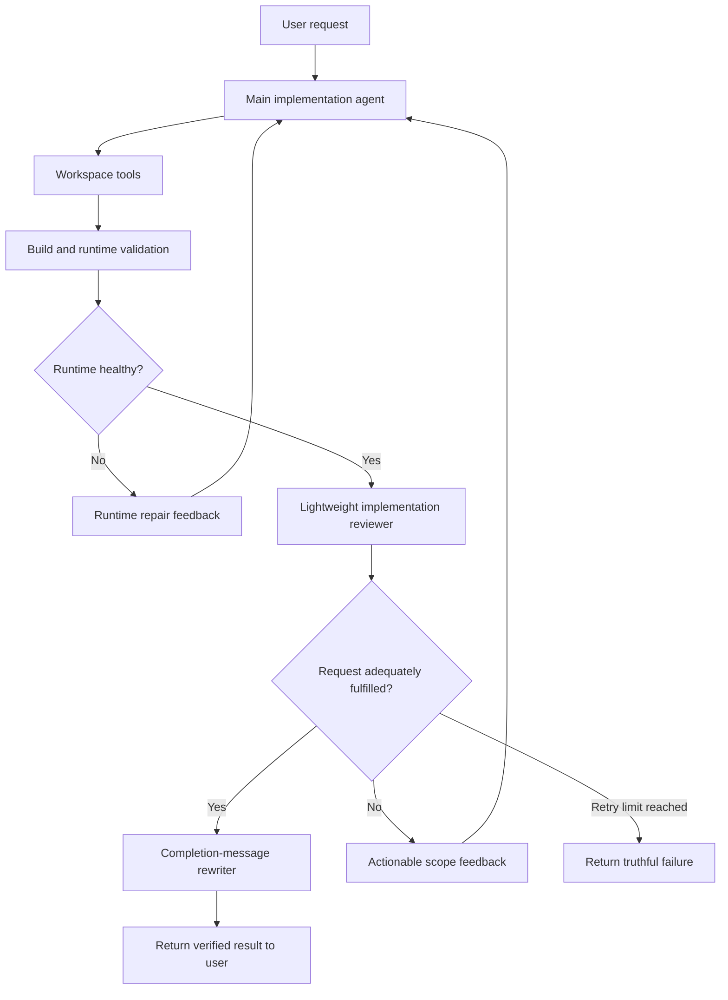

# Agent Implementation Quality and Completion Review

## Problem

The agent currently treats any successful workspace mutation as sufficient evidence that an implementation request was completed.

For example, the request:

> Make it more stylish and premium.

resulted in only three CSS-line changes:

- Two background color variables were changed.
- One flat background was replaced with a radial gradient.
- No typography, layout, component, imagery, interaction, or responsive refinements were made.

The final response nevertheless claimed that the website had received a meaningful premium redesign.

## Why the current checks allow this

The current completion flow answers objective questions but not semantic sufficiency:

1. A successful file mutation sets `workspaceChanged = true`.
2. The workspace fingerprint confirms that some filesystem content changed.
3. The build validator confirms that the project compiles.
4. The runtime monitor confirms that the preview runs.
5. The frontend quality validator checks whether the entire project has basic design-system and responsive characteristics.
6. None of these checks determines whether the latest change adequately satisfies the latest user request.

An existing polished project can therefore pass the global quality validator even when the latest request caused only a trivial change.

## Design principle

Use different validation mechanisms for different questions:

| Question | Mechanism |
|---|---|
| Did any file change? | Workspace fingerprint |
| Does the application compile? | Production build validation |
| Is the preview reachable? | Runtime monitor |
| Does the project meet basic structural quality? | Deterministic frontend quality checks |
| Does this implementation satisfy this request? | Semantic implementation reviewer |

Deterministic rules should continue handling objective correctness. An LLM reviewer should handle subjective scope and request fulfilment.

## Proposed runtime flow



## Proposed changes

### 1. Strengthen the implementation system prompt

File:

`services/agentServer/src/systemPrompts/default.ts`

Add a concise rule:

> Treat broad qualitative requests such as “more premium,” “more stylish,” “modernize,” or “improve the design” as holistic refinement requests. Consider typography, composition, palette, surfaces, imagery, interaction and responsive behavior. Do not stop after an isolated token or declaration change unless the user explicitly limited the scope.

This improves the first attempt but does not serve as the only enforcement mechanism.

### 2. Add an implementation-review prompt

New file:

`services/agentServer/src/systemPrompts/implementationReviewer.ts`

Suggested result type:

```ts
export type ImplementationReview = {
  verdict: "accept" | "retry";
  reason: string;
  feedback: string[];
};
```

The reviewer should determine:

- Whether the implementation satisfies the original request.
- Whether the magnitude of the work matches the requested scope.
- Whether important requested dimensions remain unaddressed.
- Whether the draft completion message claims more than the evidence proves.
- What concrete work the main agent should perform next.

The reviewer must not demand unnecessary breadth for narrowly scoped requests.

### 3. Collect request-specific workspace evidence

New file:

`services/agentServer/src/agentLoop/workspaceChangeEvidence.ts`

Capture the relevant workspace state at the beginning of a user run and compare it with the state at the completion boundary.

Suggested evidence:

```ts
export type WorkspaceChangeEvidence = {
  changedFiles: string[];
  addedFiles: string[];
  deletedFiles: string[];
  mutations: Array<{
    file: string;
    summary: string;
  }>;
};
```

The evidence must be scoped to the current user request. A normal repository-wide `git diff` is insufficient because the generated workspace can contain uncommitted changes from earlier chat turns.

Large file contents should not be copied blindly into the evaluator context. Prefer focused change evidence containing paths, mutation type, relevant changed regions, and concise tool-produced summaries.

### 4. Add semantic review to the agent loop

File:

`services/agentServer/src/providers/gemini.ts`

At the terminal completion boundary:

1. Confirm the workspace changed when mutation was required.
2. Run build and runtime validation.
3. Build request-specific workspace evidence.
4. Send the original request, evidence, draft response, and verification results to the lightweight reviewer.
5. Accept or retry based on the structured verdict.
6. Limit semantic-review retries to two.
7. Only rewrite and emit the final completion message after acceptance.

Suggested reviewer input:

```ts
{
  originalRequest,
  frontendLibrary,
  workspaceEvidence,
  draftCompletion,
  productionBuildHealthy,
  previewHealthy
}
```

Suggested retry feedback sent into the existing main-agent chat:

```text
The implementation review rejected completion.

Reason: The request asked for a holistic premium refinement, but the implementation only changed the background treatment.

Continue implementing the request. Address:
- typography and hierarchy
- component and section composition
- interaction states
- responsive presentation

Run the production build before completing again.
```

The main agent retains its existing conversation and tool history, so it can continue from the current workspace instead of restarting.

### 5. Ground the completion-message rewriter

File:

`services/agentServer/src/providers/gemini.ts`

Pass the accepted review facts into `rewriteCompletionMessageAgent`.

The rewriter should summarize only verified outcomes. It must not convert a small change into a broad redesign claim.

## Example review decisions

### Precise request

Request:

> Change the primary button from blue to red.

Evidence:

- One design token changed.
- Build and preview are healthy.

Decision:

```json
{
  "verdict": "accept",
  "reason": "The narrow requested color change was implemented and verified.",
  "feedback": []
}
```

### Broad request with insufficient work

Request:

> Make it more stylish and premium.

Evidence:

- One stylesheet changed.
- Two colors and one background declaration changed.

Decision:

```json
{
  "verdict": "retry",
  "reason": "The implementation only changes the background treatment and does not provide the requested holistic refinement.",
  "feedback": [
    "Strengthen typography and hierarchy.",
    "Refine navigation, cards and calls to action.",
    "Add intentional interaction states.",
    "Verify the mobile composition."
  ]
}
```

## Why not only rewrite the user prompt?

A lightweight model can turn an ambiguous request into a structured design brief, but that does not prove that the main agent performed the work. The main agent can still implement only one part of an expanded prompt and stop.

For the initial implementation, use a semantic reviewer at completion. If production data later shows that the main agent frequently begins in the wrong direction, add a request interpreter for broad or ambiguous requests.

The original user message must always remain authoritative. Any generated brief is supporting context and must not silently replace or reinterpret explicit user requirements.

## Retry and failure policy

- Maximum semantic-review retries: `2`
- Reuse the same main-agent chat and workspace.
- Feed back concrete missing work rather than a generic rejection.
- Run build and runtime checks again after additional mutations.
- Respect the existing abort signal during reviewer calls and retries.
- If the retry limit is reached, return a truthful failure instead of a fabricated success.

## Tests

Add coverage for:

- A narrow color request accepting one relevant CSS change.
- A broad premium-redesign request rejecting an isolated color change.
- A substantial multi-dimensional refinement being accepted.
- A request that needs no mutation bypassing implementation review.
- Reviewer output-schema validation and malformed-output fallback.
- Reviewer retry limits.
- Cancellation aborting an active reviewer request.
- Completion messages remaining grounded in accepted evidence.
- Workspace evidence containing only changes from the current user run.

## Rollout and evaluation

Start by recording reviewer decisions without blocking completion for a small sample of requests. Compare reviewer verdicts with human assessment and identify false accepts and false retries.

After calibration:

1. Enable blocking review for broad visual and implementation requests.
2. Monitor retry rate, completion latency, token usage and user follow-up corrections.
3. Turn real failures into a regression-evaluation dataset.
4. Keep deterministic build/runtime checks independent of semantic review.

## Success criteria

The change is successful when:

- Broad requests produce appropriately broad implementation work.
- Precise requests remain fast and focused.
- The agent cannot pass merely because one file changed.
- Completion messages describe only verified outcomes.
- Failed or incomplete work is reported honestly.
- Additional latency and token cost remain bounded.

## Related notes

- [[Agent Loop]]
- [[Workspace Fingerprints]]
- [[Runtime Monitoring]]
- [[Conversation Memory and Summarisation]]
- [[Tool Activity Events]]

