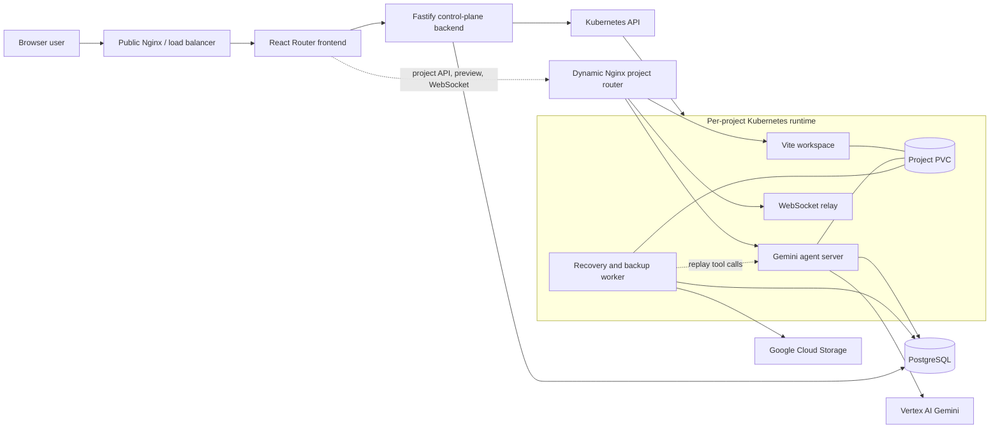
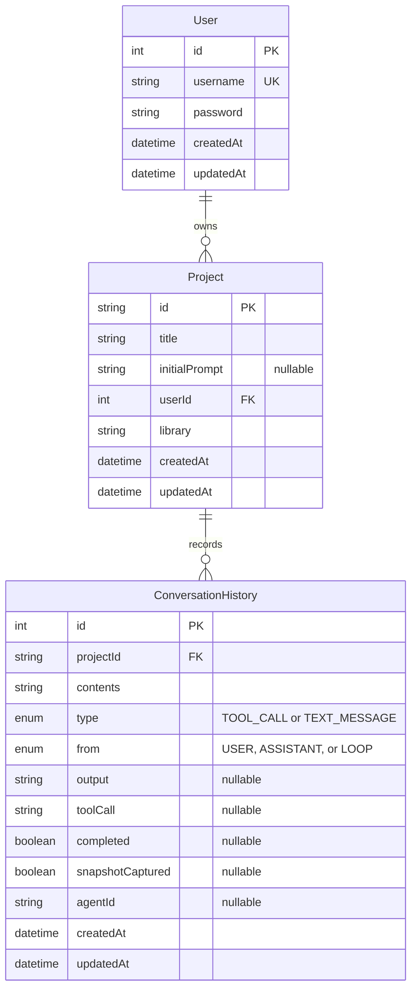

# SKY architecture

## 1. What this repository is

SKY is a prototype AI application builder. A user signs in, creates a React or Vue project, and submits an initial prompt. The control-plane backend records that project and is intended to create a dedicated Kubernetes runtime for it. That runtime contains a Vite development server, a Gemini-powered coding agent, a WebSocket relay, and a recovery/backup worker around one shared persistent volume.

This is a Bun workspaces monorepo. The root `package.json` includes `apps/*`, `packages/*`, and `services/*`. Most server-side code runs on Bun and TypeScript; the frontend is the exception and uses React Router's Node/Vite toolchain.

The repository currently contains both working pieces and partially connected infrastructure. This document distinguishes **implemented behavior** from **intended behavior** instead of treating placeholder routes and manifests as finished connections.

## 2. Component map

| Workspace or area             | Responsibility                                                                                      | Main entry point                | Direct dependencies                                            |
| ----------------------------- | --------------------------------------------------------------------------------------------------- | ------------------------------- | -------------------------------------------------------------- |
| `apps/frontend`               | Browser UI for signup, project selection, chat, code, and preview                                   | `app/root.tsx`, `app/routes.ts` | Browser -> backend HTTP API                                    |
| `apps/backend`                | Public control-plane API, authentication, project metadata, and per-project Kubernetes provisioning | `src/index.ts`                  | `@sky/db`, PostgreSQL, Kubernetes API                          |
| `packages/db`                 | Shared Prisma schema, generated client, and PostgreSQL adapter                                      | `prisma.ts`                     | PostgreSQL                                                     |
| `services/agentServer`        | Per-project Gemini coding-agent API and tool runtime                                                | `src/index.ts`                  | Vertex AI Gemini, `@sky/db`, project filesystem, Git           |
| `services/wsServer`           | Per-project WebSocket echo/broadcast server                                                         | `index.ts`                      | WebSocket clients                                              |
| `services/recovery_cron`      | Per-project snapshot and replay worker                                                              | `src/index.ts`                  | `@sky/db`, Google Cloud Storage, agent API, project filesystem |
| `services/_workspace_runtine` | Superseded image for creating and running a Vite project                                            | `entrypoint.sh`                 | npm/Vite, project filesystem                                   |
| `infra`                       | Cluster-level PostgreSQL, proxies, services, and deployment manifests                               | YAML manifests                  | GKE/Kubernetes, Nginx                                          |
| `.github/workflows`           | Container publishing and cluster deployment                                                         | workflow YAML                   | Docker Hub, GCP Workload Identity, GKE                         |

Only `@sky/db` is a reusable library package. The other workspaces are independently deployable applications or services.

## 3. Intended system topology



The database is the durable control/audit store, while the per-project PVC is meant to be the durable working tree. Object storage holds restorable filesystem snapshots. The agent's database tool-call log is intended to fill the gap between the latest snapshot and the most recent change.

## 4. Repository and workspace mechanics

The root workspace is private and has no orchestration scripts. Each deployable workspace has its own `package.json`, lockfile, TypeScript configuration, and Dockerfile. Server images build from the repository root because they need the `@sky/db` workspace. Prisma Client is generated inside those images before the application starts.

The root `index.ts` is only a Bun hello-world placeholder. `CLAUDE.md` files repeat Bun-oriented development guidance and do not add application-specific architecture. The checked-in `google-key.json` is not consumed directly by application source; local containers instead mount Application Default Credentials. A credential file should not be versioned in a production repository.

## 5. `apps/frontend`: browser application

### Technology and structure

The frontend uses React 19, React Router framework mode with SSR enabled, Vite, Tailwind CSS, Zustand, Sonner notifications, and Lucide icons.

- `app/root.tsx` is the HTML shell. On mount it calls backend `GET /whoAmI` and hydrates the auth store when the cookie is valid.
- `app/routes.ts` defines `/` and `/app`.
- `app/routes/landing.tsx` renders `LandingPage`.
- `app/routes/app.tsx` wraps the builder UI in `ProtectedRoute`.
- `app/store/authStore.ts` keeps the in-memory user and initialization state.
- `app/functions/auth.ts` implements the current signup request.
- `app/hooks/useAuth.ts` connects that request to Zustand and toast state.
- `app/components/LandingPage.tsx` provides signup, project creation, project resume, feature cards, and the static architecture image.
- `app/components/App.tsx` provides chat history, agent streaming, and the runtime preview iframe. The code panel remains a placeholder.

### Backend calls

Browser API calls use the same-origin `/api` prefix and include credentials so the HTTP-only `token` cookie is sent. Vite proxies that prefix to `localhost:3001` during local development, while the public Nginx proxy strips it in Kubernetes.

| Frontend action         | Backend call                                                        | Result                                                      |
| ----------------------- | ------------------------------------------------------------------- | ----------------------------------------------------------- |
| Restore browser session | `GET /whoAmI`                                                       | Populates the Zustand user                                  |
| “Sign up”               | `POST /signup` with a blank username and fixed development password | Backend generates a username and cookie                     |
| Show projects           | `GET /projects`                                                     | Displays the authenticated user's projects                  |
| Create a project        | `POST /createProject`                                               | Stores title/library, then navigates to `/app?project=<id>` |
| Resume a project        | `GET /projects`, then `GET /chat?projectId=<id>`                    | Resolves its name and message history                       |
| Send first prompt       | `POST /newChat`, then `POST /sendUserMessage`                       | Provisions the runtime, streams the agent, and loads preview |

Follow-up prompts use the same streaming agent endpoint. The preview iframe loads the backend-provided `http://project.tarun.co/workspace/<runtimeId>/` URL. The code pane and WebSocket-based file/status UI remain placeholders.

## 6. `apps/backend`: control plane

### HTTP server and authentication

The backend is a Fastify server on port `3001`. Zod schemas provide request/response validation, Swagger publishes the OpenAPI model, and Scalar serves documentation at `/reference`. CORS currently permits only `http://localhost:5173`.

`POST /signup` and `POST /login` hash/verify passwords with Argon2 and issue a JWT in an HTTP-only, `SameSite=Lax` cookie. `checkAuth` verifies that cookie and adds `username` and `userId` to the Fastify request object. CORS origins are configurable with `CORS_ORIGINS`.

### Routes

| Route                        | Auth   | Implemented responsibility                                             |
| ---------------------------- | ------ | ---------------------------------------------------------------------- |
| `GET /health`                | No     | Liveness response                                                      |
| `GET /whoAmI`                | Cookie | Returns the current username; clears an invalid cookie                 |
| `POST /signup`               | No     | Creates a user, generating `user-<six letters>` when username is blank |
| `POST /login`                | No     | Verifies credentials and issues a cookie/JWT                           |
| `GET /projects`              | Cookie | Lists projects for `request.userId`                                    |
| `GET /chat?projectId=`       | Cookie | Returns `TEXT_MESSAGE` records for the project                         |
| `POST /createProject`        | Cookie | Creates project metadata with React or Vue as `library`                |
| `POST /newChat`              | Cookie | Authorizes the project and provisions its Kubernetes runtime           |
| `GET /getServerUrl`          | Cookie | Placeholder                                                            |
| `POST /sendUserMessage`      | Cookie | Authorizes the project and proxies its agent SSE stream                 |
| `GET /getServerFilesAndCode` | Cookie | Placeholder                                                            |

`/newChat` updates `Project.initialPrompt` and calls `spinupK8sResources(library, projectId)`. The subsequent agent request creates the conversation row, avoiding duplicate first-message storage. The Kubernetes helper keeps the raw database UUID separate and derives the runtime ID internally.

### Kubernetes resource factory

`src/helpers/k8s.ts` uses in-cluster credentials in Kubernetes and the default kubeconfig locally, then creates these resources in the `default` namespace:

1. One 500 Mi `ReadWriteOnce` PVC.
2. Workspace, recovery, WebSocket, and agent Deployments.
3. Workspace, WebSocket, and agent ClusterIP Services.

The TypeScript manifest builders live under `apps/backend/k8s`. Every builder accepts the raw `databaseProjectId` and derives its Kubernetes prefix with `toRuntimeId`; callers never pass a prefixed ID into a manifest builder. Every resource is therefore prefixed exactly once with `sky-<database project UUID>`. The workspace initializes `my-app` from the chosen Vite template and mounts the PVC at `/app`. The agent and recovery pods mount the same PVC at `/user-app`. The recovery and agent pods use `k8s-service-account`; their database and GCP project values come from the `sky-secrets` Kubernetes Secret.

The backend is therefore the boundary between stable platform infrastructure and ephemeral project-specific infrastructure. It injects the raw `DATABASE_PROJECT_ID` as the single project identity plus `WORKSPACE_PATH`, workspace Service/container details, and the application/agent ports. Code that needs a Kubernetes name derives it with the shared `toRuntimeId(databaseProjectId)` helper. Bun processes that call the Kubernetes API explicitly load the mounted service-account CA through `NODE_EXTRA_CA_CERTS`; TLS verification remains enabled. Each generated container also declares explicit resource requests and limits so GKE Autopilot does not assign its much larger defaults to lightweight runtime and init containers. The three PVC-mounted Deployments use the `Recreate` update strategy, avoiding duplicate rolling pods contending for `ReadWriteOnce` storage and temporary quota. Vite keeps host validation enabled and receives `project.tarun.co` through `__VITE_ADDITIONAL_SERVER_ALLOWED_HOSTS`, allowing the public iframe host without accepting arbitrary domains.

## 7. `packages/db`: shared persistence layer

`@sky/db` exports one process-local Prisma client plus all generated Prisma types. Prisma 7 uses `@prisma/adapter-pg`, and `DATABASE_URL` selects the PostgreSQL database. The package's Dockerfile is a one-shot migration image that runs `prisma migrate deploy`.

### Current data model



`ConversationHistory` serves several roles: user/assistant transcript, agent run status, serialized tool-call audit log, sub-agent attribution, merge replay log, and snapshot checkpoint. Migrations show the project ID moving from integer to string, the tool enum becoming a string, and sub-agent/backup tracking being added incrementally.

## 8. `services/agentServer`: coding agent runtime

### HTTP surface

The Fastify server listens on port `3000` and exposes Scalar docs at `/reference`.

| Route                   | Purpose                                                                    |
| ----------------------- | -------------------------------------------------------------------------- |
| `POST /chat`            | Creates/reuses a `GeminiProvider` for `projectId` and streams agent events |
| `POST /continue`        | Resolves a pending `takeUserInput` promise by UUID                         |
| `POST /executeFncCalls` | Re-executes stored tool calls, including recorded worktree merges          |

`/chat` emits standard `data: ...\n\n` SSE frames. The control-plane backend forwards this stream without buffering.

### Gemini orchestration

`GeminiProvider` uses Vertex AI through `@google/genai` and the `gemini-2.5-flash` model. Its major responsibilities are:

1. Keep an in-memory Gemini chat session per project ID.
2. Send a user message and stream text/tool-call events.
3. Execute model-selected tools and feed their responses back to Gemini until no tool calls remain.
4. Persist the user run and each tool call to `ConversationHistory`.
5. Enforce completion of a model-created task plan.
6. Launch sub-agents in Git worktrees and merge their branches back serially.
7. Reduce context size by externalizing large `updateFile` payloads and eventually summarizing the chat.
8. Observe Kubernetes container state plus Vite HTTP health after mutation batches and before completion.

The main interaction is stored as a `TEXT_MESSAGE` row with `completed=false`, then marked complete with the accumulated model text in `output`. Tool invocations are stored as `TOOL_CALL` rows containing serialized arguments/context and serialized yielded UI events.

At 1,000 counted tokens, `contextualiseChat` replaces large `updateFile` arguments with pointers to files under `~/.loveable-contest/<projectId>`. After three contextualization passes, a separate Gemini session summarizes the complete history and that summary becomes a new system prompt. Both thresholds are prototype-scale values.

### Agent tools

| Tool group       | Tools                                                                        | Behavior                                                                          |
| ---------------- | ---------------------------------------------------------------------------- | --------------------------------------------------------------------------------- |
| Filesystem       | `readDirectory`, `readFileContent`, `createFile`, `updateFile`, `deleteFile` | Reads and changes files; path-aware tools reject traversal outside `context.cwd`  |
| Shell            | `executeBash`                                                                | Runs a synchronous arbitrary shell command in `context.cwd`                       |
| Task progress    | `createTaskPlan`, `informCompletedTaskFromTaskPlan`                          | Streams plan/progress events and keeps the loop active until planned IDs complete |
| User interaction | `takeUserInput`                                                              | Streams questions with a UUID and blocks until `/continue` resolves it            |
| Sub-agents       | `createSubAgent`, `waitForSubAgent`, `getCurrentWorkspace`                   | Creates a Git branch/worktree, runs another Gemini loop, waits, and merges        |

Sub-agent worktrees are placed in a sibling `worktrees/agent-<id>` directory. A global promise chain serializes merges so multiple agents cannot mutate the main worktree simultaneously. Automatic merge records use `from=LOOP` so recovery can distinguish orchestration actions from model tool calls.

The main agent now runs with `/user-app/my-app` as its tool root. Tools return a uniform `ToolResult` containing optional runtime effects. The main Gemini loop performs one runtime observation per mutation batch, checks again before completion, emits structured `runtime`/`runtimeBlocked` stream events, and limits repeated repair requests for the same failure fingerprint to three. Its HTTP observation calls the workspace Service but uses the same `/workspace/<runtimeId>/` path and `project.tarun.co` Host header as the public iframe, so Vite host validation and base-path behavior are represented accurately. Sub-agents use separate in-memory session keys while retaining the raw database project UUID. A failed first model call is emitted as an SSE error and persisted without attempting token counting on an empty chat history, so the original Vertex/IAM error is not masked.

`src/agent.ts` is an obsolete, fully commented version of the agent wrapper; the active implementation is `providers/gemini.ts`.

## 9. `services/wsServer`: WebSocket relay

This service runs a `ws` `WebSocketServer` on port `8080`. A new connection receives a welcome JSON object. Every received message is converted to text and broadcast to every open client as `Echo: <message>`.

It currently has no project protocol, authentication, agent integration, filesystem watcher, or status-event producer. Isolation is expected to come from deploying one server per project, but the frontend does not yet connect to it.

## 10. `services/recovery_cron`: snapshots and replay

The service starts two processes in the same Bun runtime:

- `recovery()` is called once at startup. It is intended to restore the newest project snapshot from Google Cloud Storage, query tool calls newer than the snapshot ID, and ask the project agent to replay them.
- `backupCron()` schedules a protected job at second 20 of every minute. It is intended to snapshot the shared volume after a completed interaction, upload `<projectId>/<conversationId>.zip`, and set `snapshotCaptured=true`.

`gcpStore` is a singleton around `@google-cloud/storage`. It lazily creates the hard-coded `lovable_backup_snapshots` bucket, uploads snapshot bytes, lists a project's objects, selects the newest by creation time, and extracts it with `unzipper`.

This service shares the database package and project PVC with the agent/workspace. Its recovery algorithm is intended to be:

If GCS is unavailable or the workload identity lacks bucket access, recovery logs the infrastructure error and releases the workspace bootstrap marker without a snapshot. Backup attempts remain protected by the cron error handler. This keeps a new project usable while making persistence degradation visible in pod logs.

```text
latest object-store snapshot
        +
database TOOL_CALL rows after the snapshot's conversation ID
        -> restored current project filesystem
```

Recovery now uses the explicit database/runtime IDs, restores into `/user-app/my-app`, creates a real ZIP archive while excluding `node_modules` and `.git`, retries the project agent Service while it starts, replays only mutation-capable tools into the main workspace, and receives a final runtime observation from the agent endpoint. Snapshot/replay remains a prototype and still needs production hardening around retention, replay idempotency, and concurrent startup ordering.

## 11. `services/_workspace_runtine`: superseded workspace image

This directory contains a Node Alpine image and entrypoint that creates `my-app` with a selected Vite template. Its README explicitly marks it unused. The active Kubernetes workspace spec now performs the same bootstrap inline using the public `node:lts-alpine` image.

The directory name itself contains the historical typo `_workspace_runtine`; workspace discovery still includes it because the root glob is `services/*`.

## 12. Infrastructure and routing

### Local Docker Compose

`docker-compose.yml` starts PostgreSQL, a migration job, WebSocket server, recovery worker, agent server, and backend. It does not start the frontend or per-project Vite workspace, and it does not reproduce dynamic project routing. Ports exposed to the host are PostgreSQL `5432`, WebSocket `8080`, agent `3000`, and backend `3001`.

### Cluster-level manifests

- `infra/pvc.yml` creates a 2 Gi `sky-pvc` for platform PostgreSQL data.
- `infra/postgres.yml` deploys PostgreSQL 16 and exposes `postgres-service:5432`.
- `infra/ingress.yml` is actually a public Nginx ConfigMap/Deployment/LoadBalancer service, not a Kubernetes `Ingress`. It routes `sky.traun.co`, `api.tarun.co`, and `project.tarun.co` to the frontend, backend, and dynamic proxy Services.
- `infra/dynamic_nginx/deployment.yml` runs internal Nginx on `nginx-custom:8080`. It extracts a project key from the URL and dynamically resolves agent, workspace, or WebSocket Kubernetes DNS names. The deployment workflow restarts both proxy Deployments after applying their ConfigMaps because their configuration files are mounted with `subPath`.
- `infra/apps/backend.yml` and `infra/apps/frontend.yml` contain the shared application Deployments and Services.
- `infra/dynamic_nginx/_nginx.conf` and `_ingress.yml` are older routing sketches retained for reference.

The active dynamic route shapes are intended to be:

| External path                 | Intended target                               |
| ----------------------------- | --------------------------------------------- |
| `/agent/<project>/<rest>`     | Project agent HTTP API                        |
| `/workspace/<project>/<rest>` | Project Vite dev server                       |
| `/ws/<project>`               | Project WebSocket server with upgrade headers |

### CI/CD and identity

`.github/workflows/services.yml` builds and pushes the agent, recovery, WebSocket, backend, and frontend images on every push to `main`. The deployment workflow runs only after that image workflow succeeds, checks out the same commit, upserts `sky-secrets`, applies platform/application manifests, pins shared apps to the commit SHA, refreshes existing project services, waits for rollouts, and applies pending Prisma migrations. If the GitHub `JWT_SECRET` is unset, the workflow preserves the cluster's current value or generates one only for a new cluster; a stable GitHub secret is still recommended for disaster recovery. Runtime Roles and RoleBindings are a cluster bootstrap prerequisite: apply `infra/app-runtime-monitor-rbac.yml` and `infra/backend-rbac.yml` once with a cluster-admin context, and apply them again whenever their rules change. The regular deployment identity intentionally does not manage RBAC.

`setup_workload_identity.sh` creates `k8s-service-account` and grants its direct GKE workload principal Vertex AI User on the project plus object-admin/bucket-reader access scoped to `lovable_backup_snapshots`. Per-project agent and recovery pods reference that Kubernetes account so Google client libraries can use short-lived Application Default Credentials without embedded keys.

## 13. End-to-end flows

### Signup and project creation

1. `root.tsx` checks `/whoAmI`; otherwise the landing page can call `/signup`.
2. The backend creates a `User`, hashes its password, and issues the cookie.
3. The browser calls `/createProject` with a title and frontend library.
4. The backend creates a `Project` with a UUID and returns it.
5. The browser navigates to the builder using that UUID.

### First prompt and provisioning

1. The builder calls `/newChat` with the raw database project UUID.
2. The backend stores `Project.initialPrompt` and provisions the runtime; the agent stores the conversation row when streaming begins.
3. The backend prefixes the UUID with `sky-` and creates the per-project PVC, four Deployments, and three Services.
4. The workspace pod creates `my-app`, installs dependencies, and runs Vite.
5. The frontend calls `/sendUserMessage`; the backend waits for the agent Service, forwards SSE events, and the iframe uses the returned workspace URL.

### Intended agent iteration

1. A caller routes the prompt to the project agent's `/chat` endpoint.
2. Gemini emits text and/or function calls.
3. The agent runs tools against the project working directory and records calls in PostgreSQL.
4. Plan, user-input, and sub-agent events stream to the caller.
5. Sub-agents work on separate Git branches/worktrees; completed branches merge into the main project tree.
6. Vite observes filesystem changes and refreshes the preview; WebSocket/status channels notify the browser.
7. The recovery worker snapshots the updated volume.

The browser-to-agent-to-preview path is connected. The WebSocket relay and code/file panel are still not connected to the UI.

## 14. Runtime contracts

### Environment variables

| Component  | Required or expected values                                                                                                                                                                              |
| ---------- | -------------------------------------------------------------------------------------------------------------------------------------------------------------------------------------------------------- |
| Frontend   | Same-origin `/api`; Vite provides the local proxy                                                                                                                                                        |
| Backend    | `DATABASE_URL`, `JWT_SECRET`, working kubeconfig/default Kubernetes credentials                                                                                                                          |
| Agent      | `DATABASE_URL`, `GCP_PROJECT_ID`, `DATABASE_PROJECT_ID`, `APP_NAMESPACE`, `WORKSPACE_PATH`, `WORKSPACE_CONTAINER`, `WORKSPACE_SERVICE`, `WORKSPACE_PORT`, `PORT`, Google Application Default Credentials |
| Recovery   | `DATABASE_URL`, `DATABASE_PROJECT_ID`, `APP_NAMESPACE`, `WORKSPACE_PATH`, `AGENT_PORT`, Google Application Default Credentials                                                                           |
| Workspace  | Selected library is interpolated into the pod command                                                                                                                                                    |
| PostgreSQL | `POSTGRES_USER`, `POSTGRES_PASSWORD`, `POSTGRES_DB`                                                                                                                                                      |

### Ports and storage

| Component     | Source-code port                                | Current Kubernetes expectation                                  | Persistent path                                                |
| ------------- | ----------------------------------------------- | --------------------------------------------------------------- | -------------------------------------------------------------- |
| Frontend      | Dev `5173`; production `3000`                   | Deployment and Service use `3000`                               | None                                                           |
| Backend       | `3001`                                          | Deployment and Service use `3001`                               | PostgreSQL only                                                |
| Agent         | `PORT`, default `3000`                          | Generated Deployment/Service use `3000`                         | PVC mounted at `/user-app`; tools rooted at `/user-app/my-app` |
| WebSocket     | `8080`                                          | `8080`                                                          | None                                                           |
| Workspace     | Vite `5173`                                     | Deployment and Service use `5173` with startup/readiness probes | PVC mounted at `/app`; application at `/app/my-app`            |
| Recovery      | No listener                                     | No Service needed                                               | PVC mounted at `/user-app`                                     |
| Dynamic Nginx | `8080`                                          | `nginx-custom:8080`                                             | ConfigMap only                                                 |
| PostgreSQL    | `5432`                                          | `postgres-service:5432`                                         | Platform PVC                                                   |

## 15. Current integration gaps and constraints

These are important when reasoning about the repository as it exists today:

1. **The file/code UI remains unfinished.** Agent streaming and preview are connected, but generated files are not returned to the code panel and the WebSocket relay is unused.
2. **Assistant transcript storage is asymmetric.** The agent stores generated text in the user run's `output`; the frontend reconstructs that output as an assistant message instead of using a separate assistant database row.
3. **Kubernetes provisioning has no rollback or cleanup.** Repeating `/newChat` reconciles named resources, but a failed partial creation is not rolled back and abandoned projects are not garbage-collected.
4. **A `ReadWriteOnce` PVC is shared across three Deployments.** This depends on the storage class and pod scheduling; it is not a portable multi-node sharing model.
5. **Namespace-level monitoring RBAC is not tenant-isolated.** The shared project ServiceAccount can list pods and read logs across the `default` namespace. Production should use per-project namespaces/ServiceAccounts or a trusted observer service.
6. **Recovery is still prototype-grade.** ZIP creation, a snapshot high-water mark, startup coordination, and replay are connected, but retention, cleanup, concurrent backups, and failure recovery still need hardening.
7. **Database migrations run from the deployed backend image.** After all shared Deployments become ready, the deployment workflow executes `prisma migrate deploy` inside the backend pod. The current runtime-monitor change does not add a new schema migration.
8. **Authentication is still prototype-grade.** The generated default-password signup path, cookie/TLS policy, rate limits, and CSRF protection need production hardening.

## 16. Where to make common changes

| Change                                 | Primary files                                                                                         |
| -------------------------------------- | ----------------------------------------------------------------------------------------------------- |
| Add or modify public API behavior      | `apps/backend/src/index.ts`                                                                           |
| Change authentication                  | `apps/backend/src/helpers/jwt.ts`, `hash.ts`, `middleware/auth.ts`, frontend auth files               |
| Change per-project Kubernetes topology | `apps/backend/k8s/**`, `apps/backend/src/helpers/k8s.ts`                                              |
| Change persisted entities              | `packages/db/prisma/schema.prisma`, then add a migration and regenerate Prisma Client                 |
| Add an agent tool                      | `services/agentServer/src/tools/*`, `tools/index.ts`, `types/tools.ts`                                |
| Change LLM/session behavior            | `services/agentServer/src/providers/gemini.ts`, `src/systemPrompts/*`                                 |
| Change project routing                 | `infra/dynamic_nginx/deployment.yml` and generated Service names/ports                                |
| Change backup/recovery                 | `services/recovery_cron/src/service/*`, `src/storage/gcp.ts`                                          |
| Connect live UI events                 | `apps/frontend/app/components/App.tsx`, agent streaming endpoint, and/or `services/wsServer/index.ts` |
| Change cluster deployment              | `infra/**`, `.github/workflows/infra.yml`, `.github/workflows/services.yml`                           |

## 17. Architectural summary

The central design is a **control plane plus isolated per-project data plane**:

- The frontend and backend are shared control-plane applications.
- PostgreSQL is the shared source of truth for users, projects, conversation state, tool logs, and snapshot checkpoints.
- The backend materializes one Kubernetes data plane per project.
- A shared project PVC connects the generated Vite application, coding agent, and recovery worker.
- Dynamic Nginx is meant to turn a project identifier in a URL into Kubernetes service discovery.
- Vertex AI provides reasoning/code generation, Git worktrees provide sub-agent isolation, and Google Cloud Storage provides filesystem durability.

That separation is now connected through the primary browser-to-agent-to-preview and snapshot/replay paths. Production hardening is still required for idempotent provisioning, security, tenancy, storage topology, and lifecycle cleanup.

## 18. `AppRuntimeMonitor` approach

> Status: implemented for the current per-project agent loop. The production-isolation and post-task supervision limitations described below still apply.

### 18.1 Goal and boundary

`AppRuntimeMonitor` should answer one narrow question for the active coding agent:

> After generated application files change, is the user's Vite application still running and serving HTTP? If it is not, what evidence can the agent use to repair the application?

It belongs inside `services/agentServer`, because that service already owns the Gemini/tool cycle and runs in the same per-project Kubernetes data plane. It does **not** need a separate supervisor or a new perpetual polling loop for the first version. Checks should be triggered by workspace mutations, successful sub-agent merges, recovery replay, and the main agent's completion boundary.

The monitor should not:

- decide which source-code edit to make;
- make Kubernetes infrastructure changes itself;
- store every application log permanently;
- treat a transient Vite reload as a crash;
- start another independent Gemini session.

The existing Gemini cycle remains the control loop:

```text
Gemini -> tool calls -> execute tools -> observe runtime -> Gemini
```

### 18.2 Repository findings that shaped the design

The implementation first had to fix these repository contracts:

| Area                 | Prior repository behavior                                                                                                                                                                                                           | Implemented contract                                                                                                                                                                                                                                                                  |
| -------------------- | ----------------------------------------------------------------------------------------------------------------------------------------------------------------------------------------------------------------------------------- | ------------------------------------------------------------------------------------------------------------------------------------------------------------------------------------------------------------------------------------------------------------------------------------- |
| Project identity     | PostgreSQL used the raw UUID, while Kubernetes resources used `sky-<UUID>`. The agent pod's single `PROJECT_ID` contained the prefixed value, while `/chat` accepted an arbitrary project ID and used it as a database foreign key. | Pass only `DATABASE_PROJECT_ID=<UUID>` as the project identity. Derive Kubernetes names with the shared `toRuntimeId(databaseProjectId)` helper, and never derive database identity by stripping a Kubernetes prefix. Validate `/chat` against the pod's configured database project. |
| External routing key | The frontend holds the raw UUID, while dynamic Nginx uses the captured URL segment directly as the Kubernetes DNS prefix.                                                                                                           | Have the backend return project URLs containing the derived runtime ID, or deliberately prepend `sky-` in one routing layer. Do not leave callers to guess which ID form a route accepts.                                                                                             |
| Agent workspace path | The PVC is mounted at `/user-app`, and Vite's project is `/user-app/my-app`, but `new GeminiProvider(projectId)` sets `cwd` to an empty string.                                                                                     | Set `WORKSPACE_PATH=/user-app/my-app` and construct the main provider with that path. Runtime checks are meaningless if tools edit the agent image instead of the shared application volume.                                                                                          |
| Workspace startup    | The generated shell command starts continuation lines with `&&` after `fi`; `sh -n` reports a syntax error.                                                                                                                         | Use a valid `set -e; ...; cd /app/my-app; npm install; exec npm run dev -- --host 0.0.0.0` script.                                                                                                                                                                                    |
| Workspace port       | Vite listens on `5173`, but the generated Service exposes `3000` and targets `8080`.                                                                                                                                                | Expose Service port `5173` with `targetPort: 5173`.                                                                                                                                                                                                                                   |
| Service discovery    | The backend creates `*-workspace-service`, `*-agent-service`, and `*-ws-server-service`; dynamic Nginx currently resolves names without `-service`.                                                                                 | Choose one naming contract and use it everywhere. The least disruptive choice is to retain the backend names and make Nginx and internal callers include `-service`.                                                                                                                  |
| Agent port           | Agent source listened on `3000`, while its generated Deployment and Service used `3001`; the `PORT` environment variable was ignored.                                                                                               | Standardize the source, Deployment, Service, and `PORT` environment variable on `3000`.                                                                                                                                                                                               |
| Kubernetes access    | `k8s-service-account` is configured for GCP Workload Identity only. No Kubernetes Role grants pod or log reads.                                                                                                                     | Add namespace-scoped RBAC for `get/list` on pods and `get` on `pods/log`. Workload Identity and Kubernetes RBAC are separate permission systems.                                                                                                                                      |
| Agent dependency     | `@kubernetes/client-node` is installed only in `apps/backend`.                                                                                                                                                                      | Add it directly to `services/agentServer/package.json`; do not rely on workspace hoisting.                                                                                                                                                                                            |
| Tool result shape    | `GeminiProvider` assumes `{ response }`, but several `updateFile` and `executeBash` branches return a bare string.                                                                                                                  | Define and enforce one `ToolResult` interface before adding runtime metadata.                                                                                                                                                                                                         |
| Sub-agent completion | Sub-agent work is merged asynchronously, and completed entries remain in the global `subAgents` object.                                                                                                                             | Await the merge as a main-loop event, mark the main workspace dirty, and remove/consume completed registry entries or filter only `IN_PROGRESS` entries.                                                                                                                              |
| Prisma schema        | `GeminiProvider` writes `ConversationHistory.cwd`, but the latest schema and migration remove that column.                                                                                                                          | Resolve the schema/source mismatch so the agent can type-check and start before adding monitoring.                                                                                                                                                                                    |

The monitor was added only after making the workspace process, filesystem path, DNS name, port, and identity contracts deterministic. Otherwise it would have reported infrastructure wiring failures that the coding model cannot repair.

### 18.3 Canonical runtime reference

All monitoring methods should accept one structured reference rather than an ambiguous `projectId` string:

```ts
interface AppRuntimeRef {
  databaseProjectId: string; // raw PostgreSQL UUID
  namespace: string; // default for the current topology
  workspacePath: string; // /user-app/my-app in the agent pod
  podLabelSelector: string; // app=<runtimeId>-workspace
  containerName: string; // node
  serviceName: string; // <runtimeId>-workspace-service
  servicePort: number; // 5173
}
```

For the current architecture, the backend injects these values into the agent Deployment:

```text
DATABASE_PROJECT_ID=<raw UUID>
APP_NAMESPACE=default
WORKSPACE_PATH=/user-app/my-app
WORKSPACE_CONTAINER=node
WORKSPACE_SERVICE=<runtime ID>-workspace-service
WORKSPACE_PORT=5173
```

The agent derives `runtimeId = toRuntimeId(databaseProjectId)` when it needs Kubernetes labels or DNS names. This keeps one transmitted identity, removes prefix guessing, and prevents a caller from making one project's agent write conversation rows for another project.

### 18.4 Runtime state model

The state needs to distinguish source-code failures from platform failures. Telling Gemini to edit React files for `ImagePullBackOff` or an RBAC denial wastes iterations.

```ts
type AppRuntimeStatus =
  | "provisioning"
  | "starting"
  | "running"
  | "unhealthy"
  | "crashed"
  | "not_found"
  | "unavailable";

type FailureScope = "application" | "infrastructure" | "unknown";

interface AppRuntimeState {
  status: AppRuntimeStatus;
  failureScope?: FailureScope;
  repairableByAgent: boolean;

  podName?: string;
  podPhase?: string;
  containerReady?: boolean;
  restartCount?: number;
  reason?: string;
  exitCode?: number;
  signal?: number;

  httpStatus?: number;
  httpErrorBody?: string;
  logs?: string;

  observedAt: string;
  fingerprint?: string;
}
```

Suggested classification:

| Observation                                                                          | Status         | Scope                                         | Agent repair?                                |
| ------------------------------------------------------------------------------------ | -------------- | --------------------------------------------- | -------------------------------------------- |
| Pod not created during the provisioning window                                       | `provisioning` | infrastructure                                | No; retry briefly                            |
| Container waiting normally or Vite starting                                          | `starting`     | application/unknown                           | Not yet; retry                               |
| Container ready and HTTP returns below `500`                                         | `running`      | application                                   | Not needed                                   |
| Container ready but HTTP is unreachable or returns `5xx` after retries               | `unhealthy`    | application                                   | Yes; include response body and logs          |
| Container terminated, `CrashLoopBackOff`, or last termination is `OOMKilled`/`Error` | `crashed`      | application or infrastructure based on reason | Only for application process failures        |
| `ImagePullBackOff`, `ErrImagePull`, `CreateContainerConfigError`, missing Secret/PVC | `crashed`      | infrastructure                                | No                                           |
| Pod absent after it was previously observed ready                                    | `not_found`    | infrastructure                                | No                                           |
| Kubernetes API/RBAC/network error                                                    | `unavailable`  | infrastructure                                | No; monitoring must not crash the agent loop |

The `fingerprint` should be a stable hash of status, reason, exit code, the final relevant log lines, and HTTP error text. It lets the loop recognize the same unresolved failure and apply a repair-attempt limit.

### 18.5 `AppRuntimeMonitor` responsibilities

Place the implementation under:

```text
services/agentServer/src/runtime/
  AppRuntimeMonitor.ts
  createAppRuntimeMonitor.ts
  formatRuntimeObservation.ts
  AppRuntimeMonitor.test.ts
```

The class should expose:

```ts
interface AppRuntimeMonitor {
  getState(ref: AppRuntimeRef): Promise<AppRuntimeState>;

  waitForSettledState(
    ref: AppRuntimeRef,
    options?: {
      attempts?: number;
      initialDelayMs?: number;
      maxDelayMs?: number;
    },
  ): Promise<AppRuntimeState>;

  getCurrentLogs(ref: AppRuntimeRef, tailLines?: number): Promise<string>;
  getPreviousLogs(ref: AppRuntimeRef, tailLines?: number): Promise<string>;
}
```

`getState` should perform these checks in order:

1. List non-terminating workspace pods using `app=<runtimeId>-workspace`.
2. Select the newest active pod deterministically.
3. Read the `node` container status.
4. Inspect `state.terminated`, `state.waiting`, and `lastState.terminated`.
5. If Kubernetes considers the container ready, request `http://<service>.<namespace>.svc.cluster.local:5173/` with a short timeout.
6. Treat a received status below `500` as proof that the web process is reachable. Treat a `5xx` response as an application failure and retain a bounded response-body excerpt because Vite often returns compiler diagnostics there.
7. Fetch logs only for a final unhealthy/crashed observation, not on every healthy check.
8. When `restartCount > 0`, try previous-container logs first; fall back to current logs.
9. Return an `unavailable` state on monitor/API errors rather than throwing through the Gemini loop.

Kubernetes logs are useful because the workspace command runs Vite as the container process and its stdout/stderr go to the container runtime. Previous logs cover only the most recent terminated container instance and are not durable after Pod deletion or node log rotation.

### 18.6 Workspace health prerequisites

The workspace Deployment should gain probes so Kubernetes state is meaningful:

```yaml
startupProbe:
  tcpSocket:
    port: 5173
  periodSeconds: 1
  failureThreshold: 120

readinessProbe:
  httpGet:
    path: /
    port: 5173
  periodSeconds: 2
  timeoutSeconds: 1
  failureThreshold: 3
```

The long startup allowance is necessary because the current pod creates a Vite project and runs `npm install` before starting the server. A later improvement should move project creation/dependency installation into an init container or prebuilt workspace image, but the monitor does not require that refactor.

Use `terminationMessagePolicy: FallbackToLogsOnError` on the workspace container. It does not replace logs, but it improves termination context for short crashes.

### 18.7 Integration with the existing Gemini loop

The monitor should check once per logical mutation batch, not after every individual file write.

First normalize tools:

```ts
interface ToolResult {
  response: string | Record<string, unknown>;
  yield?: {
    type: string;
    response: unknown;
    resolver?: Promise<unknown>;
    uuid?: string;
  };
  effects?: {
    workspaceChanged?: boolean;
    runtimeMayChange?: boolean;
  };
}
```

Known filesystem mutation tools should set both flags. `executeBash` is arbitrary, so the safe V0 behavior is to set `runtimeMayChange=true` for it and still perform only one check after the model's complete function-call batch. Read-only tools do not trigger a check.

The main-loop shape should become:

```ts
let runtimeTouched = false;
let repairAttemptsByFingerprint = new Map<string, number>();

while (hasToolCall) {
  const modelResponse = await sendToGemini(newMessage);
  const functionResponses = [];
  let runtimeDirtyThisBatch = false;

  for (const functionCall of modelResponse.functionCalls ?? []) {
    const result = normalizeToolResult(await execute(functionCall));
    functionResponses.push(toGeminiFunctionResponse(functionCall, result));

    if (result.effects?.runtimeMayChange) {
      runtimeDirtyThisBatch = true;
      runtimeTouched = true;
    }
  }

  if (runtimeDirtyThisBatch && isMainAgent) {
    const state = await monitor.waitForSettledState(runtimeRef);

    if (state.repairableByAgent) {
      functionResponses.push({ text: formatRuntimeObservation(state) });
      hasToolCall = true;
    } else if (state.failureScope === "infrastructure") {
      emitRuntimeEventToUser(state);
    }
  }

  newMessage = functionResponses;

  // Existing task-plan and sub-agent gates run here.

  if (aboutToFinish && isMainAgent && runtimeTouched) {
    const finalState = await monitor.waitForSettledState(runtimeRef);
    // Re-enter this same loop only for a repairable application failure.
  }
}
```

The runtime observation sent to Gemini should be concise and clearly delimited:

```text
[AUTHORITATIVE RUNTIME OBSERVATION]
Status: unhealthy
Reason: HTTP 500 from generated application
HTTP diagnostic: <bounded excerpt>
Recent application logs: <bounded tail>

The generated application is not healthy. Diagnose this evidence and repair
the application before completing the task.
[/AUTHORITATIVE RUNTIME OBSERVATION]
```

Do not claim that the last tool _caused_ the failure unless a healthy state was observed immediately before the batch. The monitor establishes current state, not causality.

Use a small bounded retry with backoff, for example `0.5s, 1s, 2s, 3s, 3s`. Return immediately for hard container termination. This absorbs normal Vite hot reloads without adding five seconds to every successful edit batch.

To prevent an infinite repair loop, allow at most three automatic repairs for the same fingerprint. If the same failure persists, finish the run as unsuccessful/blocked, preserve the evidence, and tell the user. A new fingerprint gets a new bounded repair budget.

### 18.8 Sub-agent behavior

Sub-agent worktrees are not the live PVC working tree, so their individual file writes must **not** trigger live application checks.

The correct sequence is:

```text
sub-agent edits isolated worktree
        -> sub-agent completes
        -> main loop awaits serialized merge
        -> merge changes live main workspace
        -> mark main runtime dirty
        -> perform one runtime check
        -> give failure evidence to main Gemini session
```

The merge promise must be part of the main loop's awaited state transition. A detached `.then(...)` can let the main loop pass its completion gate before the merged files reach the live workspace. Completed sub-agents should also be removed from the pending registry or the completion guard should count only `IN_PROGRESS` entries.

### 18.9 Recovery behavior

`POST /executeFncCalls` currently bypasses `GeminiProvider` and invokes tools directly. Recovery replay can therefore change the live workspace without passing through the normal runtime hook.

After the recovery service's placeholder IDs, paths, archive logic, Service URL, and `/executeFncCalls` path are corrected, replay should:

1. restore the snapshot into `/user-app/my-app`;
2. execute the replay batch;
3. call `waitForSettledState` once;
4. return the authoritative state to the recovery worker;
5. start an explicit agent repair request only if the failure is application-scoped.

Recovery should not create a second hidden Gemini loop automatically inside the monitor. The monitor observes; the agent endpoint decides whether to reason and repair.

### 18.10 Kubernetes permissions and isolation

The agent uses `KubeConfig.loadFromCluster()` and needs this namespace-scoped permission set:

```yaml
rules:
  - apiGroups: [""]
    resources: ["pods"]
    verbs: ["get", "list"]
  - apiGroups: [""]
    resources: ["pods/log"]
    verbs: ["get"]
```

This is functionally sufficient for the current `default`-namespace prototype, but it has a multi-tenant limitation: Kubernetes RBAC cannot restrict `list pods` by label, and every project agent currently shares the same service account. Consequently, any project agent with this Role could list pods and read logs for other projects in the namespace.

The production-safe direction is one namespace and one ServiceAccount/RoleBinding per project, or a trusted central runtime-observer service that validates project ownership and exposes only that project's state. Do not grant Deployment mutation or broad cluster-admin rights to the coding-agent pod.

### 18.11 Event flow and user-visible state

For V0, agent actions are the events that trigger observation:

```mermaid
sequenceDiagram
    participant LLM as Gemini
    participant Loop as Agent loop
    participant Tools as Tool executor
    participant Mon as AppRuntimeMonitor
    participant K8s as Kubernetes API
    participant App as Vite workspace
    participant UI as Caller/UI

    LLM->>Loop: mutation function calls
    Loop->>Tools: execute batch
    Tools->>App: shared PVC changes
    Loop->>Mon: waitForSettledState
    Mon->>K8s: pod/container state
    Mon->>App: HTTP GET /
    alt healthy
        Mon-->>Loop: running
        Loop->>LLM: normal function responses
    else application failure
        Mon->>K8s: current/previous logs
        Mon-->>Loop: failure evidence
        Loop->>LLM: function responses + runtime observation
        LLM->>Loop: diagnostic/repair tool calls
    else infrastructure failure
        Mon-->>Loop: non-repairable state
        Loop-->>LLM: do not attempt source repair
        Loop-->>UI: emit runtime status
    end
```

If the product later needs to repair crashes that happen after an agent request has fully completed, action-triggered checks are insufficient. That requires a Kubernetes Watch/event consumer and a persisted task supervisor. It should be a later feature, not hidden inside `AppRuntimeMonitor`.

### 18.12 Implementation order used

The feature was implemented in this order so each stage had a testable contract:

1. Fix project identity/environment names and validate the `/chat` project ID.
2. Point the main agent `cwd` at `/user-app/my-app` and resolve the Prisma `cwd` mismatch.
3. Fix the workspace shell command, Service name/port contract, agent port, and dynamic Nginx upstream names.
4. Add workspace startup/readiness probes and verify the Service responds from the agent pod.
5. Add `@kubernetes/client-node` plus namespace-scoped read/log RBAC.
6. Normalize `ToolResult` and add effect metadata.
7. Implement and unit-test `AppRuntimeMonitor` with an injected Kubernetes client and HTTP function.
8. Add one batched check after main-agent mutations.
9. Add the completion gate and same-fingerprint repair limit.
10. Await sub-agent merge checks and add the recovery replay check.
11. Emit structured runtime states through the existing agent stream for the future frontend preview/status UI.
    4

### 18.13 Acceptance criteria

The approach is functionally complete when these cases pass:

- A healthy Vite pod and HTTP endpoint return `running` without fetching logs.
- A temporary hot reload recovers during retry and does not create a false failure message.
- A Vite compiler/runtime `500` returns `unhealthy` with bounded HTTP diagnostics and current logs.
- `CrashLoopBackOff` after a restart returns previous-container logs.
- `OOMKilled` is visible even when application logs are empty.
- `ImagePullBackOff`, missing Secret/PVC, RBAC denial, and Pod absence are reported as infrastructure failures and do not make Gemini edit source files.
- Ten file mutations emitted in one Gemini response result in one runtime check, not ten waits.
- Read-only tools do not trigger runtime checks.
- A successful sub-agent merge triggers exactly one check in the main loop.
- The main agent cannot mark the task complete while a repairable application failure remains, subject to the bounded same-fingerprint retry policy.
- Recovery replay performs one final observation without starting a hidden agent session.
- Kubernetes API failure does not crash or deadlock the existing Gemini stream.
- Existing projects use the raw UUID for database rows and `sky-<UUID>` only for Kubernetes resources.

### 18.14 Implementation file map

| Purpose                                | Files                                                                                                                   |
| -------------------------------------- | ----------------------------------------------------------------------------------------------------------------------- |
| Runtime identity                       | `packages/runtime-id/index.ts`                                                                                          |
| Runtime contract and pod configuration | `apps/backend/src/index.ts`, `apps/backend/src/helpers/k8s.ts`, `apps/backend/k8s/services/{workspace,agent}/**`        |
| Service/DNS alignment                  | `apps/backend/k8s/services/**/service.ts`, `infra/dynamic_nginx/deployment.yml`                                         |
| Agent dependency and startup config    | `services/agentServer/package.json`, `services/agentServer/src/index.ts`                                                |
| Monitor implementation                 | `services/agentServer/src/runtime/**`                                                                                   |
| Uniform tool results/effects           | `services/agentServer/src/tools/**`, `services/agentServer/src/types/tools.ts`                                          |
| Main-loop integration                  | `services/agentServer/src/providers/gemini.ts`                                                                          |
| Recovery observation                   | `services/agentServer/src/index.ts`, `services/recovery_cron/src/service/recovery.ts`                                   |
| Pod/log RBAC                           | `infra/app-runtime-monitor-rbac.yml` and `infra/backend-rbac.yml`, applied as a cluster-admin bootstrap prerequisite     |
| Schema/source alignment                | `packages/db/prisma/schema.prisma`, a migration only if the chosen durable model changes, and regenerated Prisma Client |

This plan deliberately treats runtime monitoring as an observer attached to the existing agent state machine. The LLM continues to decide how to repair application code, Kubernetes remains authoritative for container state and logs, and HTTP remains authoritative for whether the generated web application actually responds.
