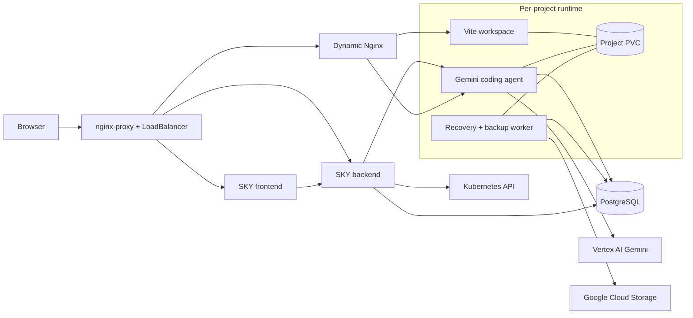
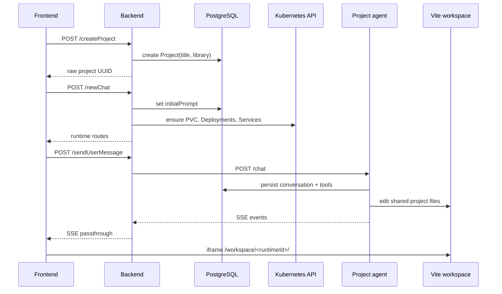
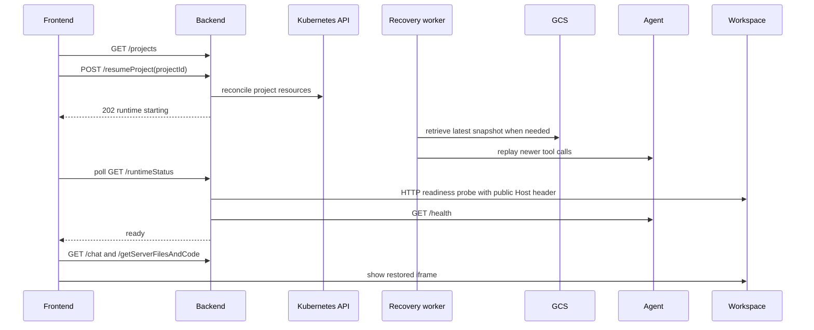

# SKY implementation changes

## Purpose and scope

This document explains the code and behavior added while turning SKY from a partially connected prototype into an end-to-end frontend application builder with monitored per-project Kubernetes runtimes.

It covers the functional work from the monitored-runtime integration (`4308d44`) through the concise completion-message update (`4d9d5fe`). It also summarizes the earlier CI and Kubernetes specification fixes that made the larger integration possible. The separate [`infra-challenges.md`](./infra-challenges.md) document focuses on operational failures, Kubernetes constraints, ingress/Nginx behavior, and deployment lessons.

The most important architectural decision is the separation between:

- a shared **control plane**: frontend, backend, PostgreSQL, ingress and shared proxies;
- a per-project **runtime/data plane**: workspace, coding agent, recovery worker, services and PVC.

## Current architecture



The browser receives agent progress and final messages through Server-Sent Events (SSE). It does not use a project WebSocket relay. The generated application is displayed in an iframe through the dynamic workspace route.

## Core identity contract

Two identifiers were previously mixed together. The code now uses them deliberately:

| Identifier | Example | Purpose |
| --- | --- | --- |
| Database project ID | `72668d06-cc23-4173-87f0-18864c35593b` | PostgreSQL foreign keys, API authorization and stable project identity |
| Runtime ID | `sky-72668d06-cc23-4173-87f0-18864c35593b` | Kubernetes-safe resource names and project routing |

`packages/runtime-id/index.ts` owns the conversion through `toRuntimeId(databaseProjectId)`. Kubernetes manifest builders accept the raw database ID and derive the runtime ID internally. This prevents double prefixes such as `sky-sky-...` and prevents Kubernetes names from leaking into database queries.

## Change history by implementation phase

### Phase 0: CI and Kubernetes foundations

The early commits fixed the build/deployment foundation before the runtime could work reliably:

- normalized lowercase Docker image tags;
- added repository checkout to the image workflow;
- corrected Dockerfile and agent paths;
- aligned image names used by manifests and Docker Hub;
- repaired GitHub Actions triggers and permissions;
- iterated on invalid or inconsistent Kubernetes specifications;
- made the service-image workflow publish backend, frontend, agent and recovery images.

These changes are represented by the commits from `9daba39` through `fd968d4`. Several intermediate Kubernetes fixes were superseded by the monitored-runtime implementation, but they exposed the naming, port and manifest-shape problems described in the infrastructure document.

### Phase 1: monitored project runtimes (`4308d44`)

This was the main end-to-end integration.

#### Runtime identity and manifest contract

- Added `packages/runtime-id` and tests.
- Standardized project-specific names across workspace, agent, recovery, PVC and Services.
- Ensured database rows keep the raw UUID while Kubernetes resources use the derived runtime ID.
- Added a runtime contract test covering resource names, ports, environment variables and shell commands.

#### Workspace runtime

- Corrected the workspace shell script and Vite startup command.
- Standardized Vite and its Service on port `5173`.
- Mounted the project PVC at `/app`, with the user application at `/app/my-app`.
- Added startup/readiness probes and termination diagnostics.
- Started Vite with the project-specific base path:

```text
/workspace/<runtimeId>/
```

#### Agent runtime

- Standardized the agent HTTP API and Service on port `3000`.
- Mounted the shared PVC at `/user-app` and rooted tools at `/user-app/my-app`.
- Added a configured database project ID check so one project agent cannot accept another project's ID.
- Added direct Kubernetes-client support to the agent package.
- Normalized tool results into a shared `ToolResult` shape with explicit runtime effects.

#### `AppRuntimeMonitor`

Added `services/agentServer/src/runtime/AppRuntimeMonitor.ts` and its supporting factory, formatter and tests.

The monitor:

1. locates the current workspace pod;
2. examines waiting, running and terminated container states;
3. probes the Vite application over HTTP;
4. retrieves current or previous logs only when useful;
5. classifies failures as application, infrastructure or unknown;
6. reports whether the coding agent can repair the problem;
7. generates a stable fingerprint to bound repeated repairs.

The Gemini loop checks the runtime after mutation batches and again before completion. Repairable Vite/build failures return authoritative evidence to Gemini. Infrastructure failures such as missing images, PVCs or RBAC permissions are shown to the user without asking the coding model to edit frontend source code.

#### Backend and frontend integration

- Connected the backend to the agent SSE endpoint.
- Added project-derived workspace and agent routes.
- Connected the frontend prompt form to `/newChat` and `/sendUserMessage`.
- Displayed structured runtime/plan state instead of leaving the user at an unexplained “Generating” state.
- Added the production frontend deployment and same-origin `/api` routing contract.

#### Recovery integration

- Corrected snapshot creation and GCS object naming.
- Coordinated workspace startup with snapshot restoration.
- Replayed tool calls newer than the restored snapshot high-water mark.
- Added a final runtime observation after replay.

### Phase 2: production hardening

#### RBAC separation (`515b5f8`)

Runtime Roles and RoleBindings were moved out of the normal deployment workflow. They are bootstrap resources that need a cluster-admin context, while the regular GitHub deployment identity intentionally has narrower permissions.

#### Prisma generation (`87d86ec`)

The backend image now generates Prisma Client during the Docker build. This fixed runtime failures caused by deploying an image whose generated client did not match the checked-in schema and installed Prisma version.

#### Runtime deployment hardening (`82e7bc1`)

- Added explicit resource requests and limits.
- Improved authentication and JWT handling.
- Added stable secret handling in the deployment workflow.
- Added workload-identity configuration for Vertex AI and GCS.
- Improved runtime-monitor classification and recovery behavior.
- Hardened PostgreSQL persistence and deployment configuration.

#### Local hostname contract (`6933c48`)

The public/local names were standardized to:

- `sky.traun.co` for the SKY UI and same-origin API;
- `api.tarun.co` for direct backend access;
- `project.tarun.co` for generated application previews.

The typo in `sky.traun.co` is intentional because it matches the user's selected hostname and current configuration.

#### HTTP-origin client IDs (`27a806b`)

The frontend originally assumed `crypto.randomUUID()` was available. That API may be unavailable on an insecure HTTP origin. `createClientId()` now uses it when present and provides a safe fallback, allowing chat submission on the current HTTP deployment.

### Phase 3: user-visible agent progress and control

#### Durable activity stream (`7cdddf6`)

Added `apps/frontend/app/functions/agentActivity.ts` and tests. It reduces SSE events into user-visible states for:

- task plans and completed steps;
- runtime provisioning, health and repair;
- agent questions;
- errors and manual stops.

The UI now shows what the agent is doing instead of displaying an indefinite generic spinner.

#### Context archives on the project volume (`667899f`)

Large historical `updateFile` arguments were consuming the model context and could be accidentally copied back into source files. The new context archive:

- replaces large historical payloads with stable artifact references;
- persists those artifacts under the shared project volume;
- provides `readContextArtifact` for exact retrieval;
- rejects artifact references when a file tool is asked to write them literally.

This makes contextualisation survive pod restarts and project resume.

#### Agent questions and continue flow (`807640c`)

The `takeUserInput` tool can pause an agent and emit structured questions. The frontend renders those questions as a form, and the authenticated backend `/continue` route forwards the user's answers to the correct project agent and request UUID.

#### Stop generation and workspace execution (`eba1df0`)

- Added a project-scoped active-run registry.
- Added `/stop` to the agent and backend.
- Aborted model streaming, tool execution and pending user-input waits.
- Added a Stop button to the frontend.
- Reworked `executeBash` so commands run inside the workspace container through Kubernetes exec instead of inside the agent image.
- Added cancellation support and finite execution behavior.

### Phase 4: stable rollouts, source view and chat restoration

#### Stable runtime rollouts (`0aaca6b`)

- Added immutable runtime image tags derived from the deployment commit SHA.
- Changed project PVC-mounted Deployments to the `Recreate` strategy.
- Added required pod affinity so workspace, agent and recovery are scheduled compatibly with the `ReadWriteOnce` project disk.
- Added explicit agent memory limits and init-container resource settings.
- Updated the deploy workflow to refresh existing project workloads as well as newly created ones.

#### Generated-file browser (`079a859`)

- Added agent `GET /files`.
- Added backend `GET /getServerFilesAndCode` with project ownership checks.
- Added a bounded workspace-file scanner that excludes dependencies, secrets and unsafe symlinks.
- Replaced the empty Code panel with a file list and read-only source viewer.

The Code tab is intentionally read-only. Editing still happens through the coding agent.

#### Preview and chat-history restoration (`3619bc2`)

- Added deterministic mapping from `ConversationHistory` records to user and assistant bubbles.
- Reconstructed assistant output stored alongside the originating user row.
- Loaded saved history when opening a project.
- Restored the project name and preview URL from backend project metadata.
- Fixed first-message detection so a resumed project does not provision as if it were new.

### Phase 5: agent policy, streaming and quality enforcement

#### Frontend-only framework contract (`3f2379f`)

The persisted project library is now passed into the agent. The system prompt enforces:

- frontend-only work;
- React-only or Vue-only implementation based on the selected project;
- no CLI, backend, database or native-application generation;
- no requests for the user to install Node/Python;
- actual workspace mutations for implementation requests;
- responsive and accessible visual quality.

For out-of-scope backend concepts, the agent may build a visible mocked frontend experience using in-memory data or `localStorage`, but it must not silently change the project type.

#### Transient tool activity (`64d8733`)

Every tool call now emits a short `started`, `completed` or `failed` summary. The frontend shows this in a muted transient status area rather than adding noisy permanent chat bubbles. Tool summaries describe intent without exposing commands or file contents.

#### WebSocket relay removal (`fe78cf0`)

The unused per-project WebSocket service, Deployment, image build and Nginx route were removed. SSE already provides the required browser progress stream:

```text
Agent SSE -> backend passthrough -> browser
```

The deployment workflow also deletes retired WebSocket resources from existing clusters.

#### Gemini streaming configuration fix (`8c759cf`)

`@google/genai` per-request streaming configuration did not inherit the chat's system instruction and tool declarations when an abort signal was supplied. The fix introduced `createGeminiGenerationConfig()` and repeats the system/tool configuration on every streamed request. Without this, Gemini could return prose without access to workspace tools.

#### Production-build validation (`6053f54`)

A healthy Vite HTML response does not prove imported JSX or TypeScript compiles. Before accepting completion, the agent now runs a finite production build in the workspace container and returns compiler diagnostics to Gemini for repair.

#### Stuck-command prevention (`53222a1`)

- Added finite command timeouts and cancellation.
- Prevented the agent from starting another foreground dev server when Vite is already running.
- Treated arbitrary shell commands conservatively as runtime-affecting.

This prevents commands such as `npm run dev` from blocking the agent loop indefinitely.

#### Frontend-quality validation (`dd1ffbf`, `f8ac1ec`)

Added a deterministic completion-time quality review that rejects obvious starter/demo output and common layout failures, including:

- untouched Vite starter content;
- weak, barely styled pages;
- missing interaction/focus states;
- fixed-width desktop layouts that clip horizontally;
- low-effort completion without the required task plan or workspace mutation.

The system prompt was expanded with an explicit product and visual quality bar. Substantive pages use an ordered three-to-six-step task plan. The current task tool is an ordered plan, not a DAG scheduler.

### Phase 6: complete project resume (`25f4b2c`, `3cedc0d`)

The original Resume button only navigated to `/app`; it did not recreate missing Kubernetes resources.

The completed flow adds:

- authenticated `POST /resumeProject`;
- idempotent Kubernetes reconciliation for the selected project;
- authenticated `GET /runtimeStatus`;
- frontend “Restoring your project” state;
- readiness polling until both workspace and agent are healthy;
- automatic preview activation;
- automatic source-file preload;
- restored chat history and project name;
- disabled duplicate resume clicks;
- clickable SKY logo navigation back to `/`;
- correction of the frontend `feLibrary`/database `library` mismatch.

The runtime readiness probe initially stayed in `starting` even with healthy pods. Vite rejected the internal Kubernetes Service hostname. The backend probe now sends the public `Host: project.tarun.co` header, matching the iframe and Vite allowed-host contract.

### Phase 7: accurate homepage capabilities (`d2f0b5a`)

The homepage feature cards previously claimed unsupported behavior such as per-project namespaces, autoscaling, a DAG planner, a fixed six-agent limit, S3-compatible storage and snapshots on every commit.

The cards now describe implemented capabilities:

1. Kubernetes Runtime
2. Project Recovery
3. Live Preview & Source
4. Task Planning
5. Contextualisation
6. Summarisation
7. Sub-Agents & Worktrees
8. Runtime Validation
9. Dynamic Nginx Routing

### Phase 8: concise agent completion messages (`4d9d5fe`)

The implementation agent used to return long file-by-file changelogs and repeated verification instructions. The completion path now has two safeguards:

1. The main system prompt requires two or three short sentences, no more than 80 words.
2. A separate no-tools completion formatter rewrites the accepted draft into an outcome-first user message.

The formatter receives only the user request, the draft and grounded verification facts. It must not invent files, features or successful checks. Overlong output or formatter failure falls back to a short deterministic message. Stop requests also cancel this final formatting operation.

Existing long messages remain in persisted chat history; only new completions use the concise contract.

### Phase 9: path-aware builds with a shared deployment SHA

The image workflow now avoids rebuilding unchanged components without changing
the Kubernetes runtime-version contract:

- `.github/scripts/detect-components.sh` classifies the files changed between
  the push's base and head commits, including shared-package dependencies;
- the four image publishing jobs run in parallel;
- a changed component is built and receives both `latest` and the immutable
  commit-SHA tag;
- an unchanged component uses `docker buildx imagetools create` to copy its
  existing `latest` manifest to the new commit-SHA tag without downloading
  layers or executing its Dockerfile;
- real builds use component-scoped GitHub Actions layer caches;
- all four repositories therefore still expose the triggering Git SHA, allowing
  the existing deployment workflow and shared `RUNTIME_IMAGE_TAG` contract to
  remain unchanged.

This deliberately optimizes image construction rather than Kubernetes rollout
behavior. The deployment workflow still assigns the new tag string to shared and
per-project workloads, so Kubernetes can roll them even when the underlying image
digest is unchanged.

After this change, the repository test suite still reports **66 passing tests**.
The workflow YAML, detector script and embedded workflow shell scripts have also
been syntax-checked locally.

## Current request flows

### Create a project and send the first prompt



### Follow-up prompt

The frontend skips `/newChat`, sends the new message to `/sendUserMessage`, receives the same SSE event types and refreshes the preview after the runtime becomes healthy.

### Resume a project



### Agent SSE event model

| Event | Meaning in the frontend |
| --- | --- |
| `message` | Accepted final assistant response |
| `toolActivity` | Short transient tool status |
| `plan` | Ordered task list |
| `planComplete` | One planned task completed |
| `runtime` | Provisioning, running or failure state |
| `runtimeBlocked` | Same runtime failure remained after bounded repair attempts |
| `askInput` | Agent is waiting for structured user answers |
| `error` | Terminal or surfaced error |
| `stopped` | User cancelled the active generation |

## Code map by responsibility

### Frontend

| File | Responsibility |
| --- | --- |
| `apps/frontend/app/components/LandingPage.tsx` | Authentication entry, new project modal, resume project picker, restore request and logo navigation |
| `apps/frontend/app/components/App.tsx` | Chat, SSE consumption, plan/tool/runtime UI, questions, Stop, preview iframe and Code tab |
| `apps/frontend/app/functions/agentActivity.ts` | Pure reducer/parser for streamed activity |
| `apps/frontend/app/functions/chatHistory.ts` | Converts persisted conversation rows into chat bubbles |
| `apps/frontend/app/functions/clientId.ts` | Browser-safe client IDs on HTTP and HTTPS origins |
| `apps/frontend/app/config.ts` | Same-origin `/api` URL contract |
| `apps/frontend/app/features.ts` | Accurate homepage capability cards |

### Backend control plane

| File | Responsibility |
| --- | --- |
| `apps/backend/src/index.ts` | Authenticated API, project ownership, runtime provisioning/resume, SSE proxy, continue/stop and file proxy |
| `apps/backend/src/helpers/k8s.ts` | Idempotent Deployment/Service apply and PVC ensure logic |
| `apps/backend/src/helpers/runtime.ts` | Public runtime routes and workspace/agent readiness probes |
| `apps/backend/k8s/**` | TypeScript builders for project PVC, Deployments and Services |
| `packages/runtime-id/index.ts` | Raw project ID to Kubernetes runtime ID conversion |

### Agent runtime

| File | Responsibility |
| --- | --- |
| `services/agentServer/src/index.ts` | Agent HTTP surface: health, chat, continue, stop, files and recovery replay |
| `services/agentServer/src/providers/gemini.ts` | Main model/tool loop, persistence, plans, sub-agents, runtime checks and concise final messages |
| `services/agentServer/src/providers/geminiConfig.ts` | Reusable streamed-request system/tool configuration |
| `services/agentServer/src/runtime/AppRuntimeMonitor.ts` | Kubernetes and HTTP application observation |
| `services/agentServer/src/runtime/executeInWorkspace.ts` | Bounded cancellable Kubernetes exec in the workspace container |
| `services/agentServer/src/runtime/validateFrontendBuild.ts` | Production-build completion gate |
| `services/agentServer/src/runtime/validateFrontendQuality.ts` | Deterministic visual/product quality gate |
| `services/agentServer/src/runtime/workspaceFiles.ts` | Safe generated-source listing |
| `services/agentServer/src/runtime/AgentRunRegistry.ts` | One active cancellable run per project |
| `services/agentServer/src/context/contextArchive.ts` | Durable compaction artifacts on the project volume |
| `services/agentServer/src/systemPrompts/default.ts` | Frontend/framework/quality/completion contract |
| `services/agentServer/src/systemPrompts/completionAgent.ts` | Final-response rewrite and bounded fallback |
| `services/agentServer/src/toolActivity.ts` | Privacy-safe one-line tool summaries |
| `services/agentServer/src/tools/**` | File, shell, task, input, context and sub-agent tools |

### Recovery

| File | Responsibility |
| --- | --- |
| `services/recovery_cron/src/service/cron.ts` | Periodic snapshot after a completed unsnapshotted user turn |
| `services/recovery_cron/src/service/recovery.ts` | Restore snapshot, mark workspace ready and replay newer tool calls |
| `services/recovery_cron/src/storage/gcp.ts` | GCS bucket/object operations |

## Database impact

No new Prisma schema change was required for the later resume, preview, activity, quality or completion-message work.

The existing schema already stores:

- users and hashed credentials;
- projects, selected frontend library and initial prompt;
- conversation text;
- final agent output;
- tool-call arguments and results;
- completion/snapshot flags;
- agent IDs for sub-agent history.

The agent's final response is persisted in the originating user's `ConversationHistory.output`. `mapChatHistory()` recreates the assistant bubble when the project is reopened.

## Verification added

The repository currently has tests for:

- runtime ID derivation and Kubernetes naming contracts;
- workspace shell syntax, ports, probes, resources and affinity;
- project readiness URLs and Host headers;
- SSE activity parsing and reduction;
- chat-history reconstruction;
- HTTP-safe client IDs;
- sub-agent lifecycle;
- tool effects and command safety;
- context archiving and traversal rejection;
- streamed Gemini tool configuration;
- agent cancellation and user-input interruption;
- runtime-monitor failure classification and fingerprints;
- workspace file filtering;
- production-build validation;
- frontend quality validation;
- snapshot archive contents;
- concise completion-message policy and fallback behavior.

At commit `4d9d5fe`, the complete repository suite reported **66 passing tests** and the agent-server TypeScript check passed.

## Important remaining limitations

1. All project workloads currently share the `default` namespace.
2. Project PVCs are `ReadWriteOnce`, so the topology depends on pod affinity and the current storage class.
3. Runtime creation has no transactional rollback or abandoned-project garbage collection.
4. The generated-file view is read-only.
5. Authentication, CSRF protection, rate limiting and TLS are still prototype-grade.
6. Recovery has no retention/cleanup policy and limited concurrent-failure handling.
7. Assistant messages are reconstructed from user-row output instead of separate assistant rows.
8. The task plan is ordered; it is not a DAG resolver or dependency scheduler.
9. The deploy workflow still repins and restarts existing project runtimes on every successful image workflow, even when an image was only retagged.
10. The static homepage architecture PNG predates several of these changes and should be redrawn using the current routing and SSE model.

## Reading order

To understand the implementation in runtime order:

1. `packages/runtime-id/index.ts`
2. `apps/backend/src/index.ts`
3. `apps/backend/src/helpers/k8s.ts`
4. `apps/backend/k8s/services/workspace/deployment.ts`
5. `apps/backend/k8s/services/agent/deployment.ts`
6. `apps/backend/k8s/services/recovery_cron/deployment.ts`
7. `services/recovery_cron/src/service/recovery.ts`
8. `services/agentServer/src/index.ts`
9. `services/agentServer/src/providers/gemini.ts`
10. `services/agentServer/src/runtime/AppRuntimeMonitor.ts`
11. `services/agentServer/src/runtime/validateFrontendBuild.ts`
12. `services/agentServer/src/runtime/validateFrontendQuality.ts`
13. `apps/frontend/app/components/LandingPage.tsx`
14. `apps/frontend/app/components/App.tsx`
15. `infra/ingress.yml`
16. `infra/dynamic_nginx/deployment.yml`
17. `.github/workflows/services.yml`
18. `.github/scripts/detect-components.sh`
19. `.github/workflows/infra.yml`

For the operational reasoning behind these contracts, continue with [`infra-challenges.md`](./infra-challenges.md).
