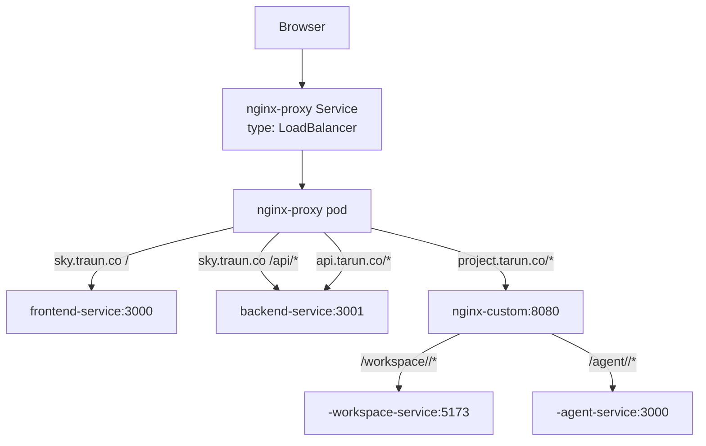

# SKY infrastructure challenges and solutions

## Purpose

This document records the Kubernetes, networking, storage, identity and deployment problems encountered while making SKY work end to end. Each section describes the visible symptom, the actual root cause, the implemented fix, and the contract that should be preserved.

For the application and agent code history, see [`implementation-changes.md`](./implementation-changes.md). For the original broad architecture notes and detailed `AppRuntimeMonitor` design, see [`arch.md`](./arch.md).

## Current public routing topology



The shared `nginx-proxy` is both the public host/path router and the workload behind the LoadBalancer Service. Dynamic Nginx is a second internal proxy used only for project-specific routes.

Normal chat traffic does not need the public `/agent/<runtimeId>` path. The frontend calls the shared backend, and the backend calls the internal agent ClusterIP service directly.

## Per-project Kubernetes topology

For database project ID `<uuid>`, `toRuntimeId()` produces `sky-<uuid>`.

The backend reconciles:

| Resource | Name | Purpose |
| --- | --- | --- |
| PVC | `<runtimeId>-pvc` | Durable workspace shared by the three project workloads |
| Deployment | `<runtimeId>-workspace` | Node/Vite user application |
| Service | `<runtimeId>-workspace-service` | ClusterIP on port `5173` |
| Deployment | `<runtimeId>-agent-deployment` | Gemini agent and tools |
| Service | `<runtimeId>-agent-service` | ClusterIP on port `3000` |
| Deployment | `<runtimeId>-recovery` | Snapshot restore, replay and backup cron |

The three Deployments mount the same `ReadWriteOnce` project PVC. The workspace mounts it at `/app`; the agent and recovery containers mount it at `/user-app`.

## Challenge 1: database IDs and Kubernetes names were mixed

### Symptom

- Database lookups sometimes received `sky-<uuid>` instead of the actual project UUID.
- Some resources risked names such as `sky-sky-<uuid>`.
- Dynamic Nginx, backend routes and generated Services disagreed about the route key.

### Root cause

`runtimeId` and `databaseProjectId` were treated as interchangeable strings. Code sometimes added or removed the `sky-` prefix at arbitrary boundaries.

### Solution

- Keep the raw project UUID as the only persisted/transmitted database identity.
- Derive Kubernetes names with `packages/runtime-id/toRuntimeId()`.
- Make every manifest builder accept `databaseProjectId` and derive once internally.
- Return both the database ID and derived runtime routes from the backend when the browser needs routing information.
- Add tests for empty IDs, UUID length, valid DNS names and double-prefix prevention.

### Preserved contract

Never strip `sky-` to recover a database ID. Never pass an already-prefixed ID into a Kubernetes manifest builder.

## Challenge 2: ports, Service names and workspace paths disagreed

### Symptom

- Pods could be running while Services returned connection errors.
- The agent could not reach the workspace.
- Dynamic Nginx resolved names that did not exist.
- Tool changes did not appear in the preview because the agent edited the wrong filesystem.

### Root cause

The original code mixed:

- Vite `5173` with Service ports `3000`/`8080`;
- agent source port `3000` with manifest port `3001`;
- Service names with and without the `-service` suffix;
- `/user-app`, `/app` and process-local directories.

### Solution

Standardized the runtime contract:

```text
Workspace source:          /user-app/my-app in agent/recovery
Workspace container path: /app/my-app
Workspace HTTP:           5173
Agent HTTP:               3000
Workspace Service:        <runtimeId>-workspace-service
Agent Service:            <runtimeId>-agent-service
```

The agent's file tools use the PVC mount directly. Shell tools use Kubernetes exec to run inside the workspace container at `/app/my-app`.

## Challenge 3: the workspace startup shell was invalid and race-prone

### Symptom

- Workspace containers exited before Vite started.
- A new Vite scaffold could overwrite or race with restored files.
- Agent initialization could begin before the workspace was usable.

### Root cause

The generated shell contained invalid continuation syntax and did not coordinate project bootstrap with recovery.

### Solution

- Replaced the script with a valid `set -eu` sequence.
- Added shell-syntax validation in the runtime contract test.
- Added a `.sky-restore-ready` marker on the shared volume.
- Made a new workspace wait for recovery to finish checking/restoring the snapshot before scaffolding.
- Made the agent init container wait for both `package.json`, `.git` and workspace Service connectivity.
- Added a long startup probe because first boot includes Alpine packages, Vite scaffolding and `npm install`.

### Remaining concern

Installing OS and npm dependencies at container startup is slow and network-dependent. A prebuilt workspace image or init-container strategy would be more predictable.

## Challenge 4: Kubernetes readiness did not equal application correctness

### Symptom

The pod could be Ready and Vite could return an HTML shell while an imported JSX module still failed to compile. The agent would declare success even though the preview showed an error.

### Root cause

Container readiness only proves the HTTP process is reachable. Vite's development server can remain alive during module compilation failures.

### Solution

Completion now requires multiple layers:

1. Kubernetes pod/container observation;
2. HTTP probe through the same base path used by the iframe;
3. bounded Vite error-body/log collection;
4. finite production build in the workspace container;
5. deterministic frontend-quality review.

`AppRuntimeMonitor` returns repairable application evidence to Gemini and classifies infrastructure errors separately.

## Challenge 5: Vite rejected the internal readiness probe

### Symptom

The Resume screen stayed at “Restoring your project” even though workspace and agent Deployments were `1/1` Ready and the public preview worked.

### Root cause

The backend probed:

```text
http://<runtimeId>-workspace-service.default.svc.cluster.local:5173/workspace/<runtimeId>/
```

Vite host validation rejected the internal Kubernetes DNS name. The response was not `2xx`, so `/runtimeStatus` kept returning `starting`.

### Solution

The internal probe now sends:

```http
Host: project.tarun.co
```

This matches `__VITE_ADDITIONAL_SERVER_ALLOWED_HOSTS` and the actual iframe host. A regression test asserts the header.

### Lesson

Readiness probes should exercise the same host and base-path assumptions as the user-facing route. A raw internal Service request can produce a false failure when the application validates `Host` or routing prefixes.

## Challenge 6: Kubernetes RBAC and Google Workload Identity are different

### Symptom

The project agent could authenticate to Vertex AI but could not list pods, read logs or execute commands in the workspace. Conversely, a Kubernetes Role alone did not grant GCS or Vertex access.

### Root cause

Two independent permission systems were conflated:

- Kubernetes RBAC controls Kubernetes API operations.
- GKE Workload Identity / Google IAM controls Google Cloud APIs.

### Solution

`k8s-service-account` receives:

- namespace-scoped Kubernetes permissions for pod reads, logs and exec;
- Google IAM permissions for Vertex AI and the snapshot bucket through Workload Identity.

The backend uses `sky-backend-sa` with permission to reconcile Deployments, Services and PVCs.

### Deployment decision

RBAC manifests are cluster bootstrap prerequisites and are not applied by the regular CI deployment identity. Apply these with a cluster-admin context when creating a cluster or changing rules:

```text
infra/app-runtime-monitor-rbac.yml
infra/backend-rbac.yml
```

### Remaining concern

All project agents currently share the same ServiceAccount and namespace. Kubernetes cannot restrict `list pods` by label, so production tenant isolation needs per-project namespaces/ServiceAccounts or a trusted central observer.

## Challenge 7: in-cluster TLS verification failed

### Symptom

Bun processes using the Kubernetes client could fail certificate verification against the Kubernetes API.

### Root cause

The service-account CA mounted by Kubernetes was not automatically included in the runtime's trusted CA set.

### Solution

Set:

```text
NODE_EXTRA_CA_CERTS=/var/run/secrets/kubernetes.io/serviceaccount/ca.crt
```

for backend/agent processes that call the Kubernetes API. TLS verification remains enabled; the fix does not disable certificate checking.

## Challenge 8: one `ReadWriteOnce` PVC across three Deployments

### Symptom

- Rolling updates could create old and new pods simultaneously.
- GKE could schedule them on different nodes.
- The volume produced multi-attach failures or left replacement pods Pending.
- Temporary duplicate pods consumed excessive Autopilot resources.

### Root cause

`ReadWriteOnce` generally permits one-node attachment, not arbitrary multi-node access. Kubernetes rolling updates default to overlapping replicas, and independent Deployments have no automatic same-node guarantee.

### Solution

- Set `strategy: { type: "Recreate" }` on workspace, agent and recovery Deployments.
- Add required pod affinity so agent and recovery follow the workspace pod's node.
- Add explicit resource requests/limits to avoid oversized Autopilot defaults.
- Make init-container requests small and bounded.
- Refresh existing Deployments during CI so older projects receive the same strategy, affinity, image and environment contracts.

### Remaining concern

This topology is workable for the current prototype but is not a portable shared-filesystem design. A production version should consider one multi-container pod, `ReadWriteMany` storage, or a different workspace service boundary.

## Challenge 9: image drift between shared services and project runtimes

### Symptom

- `latest` could resolve differently across pod restarts.
- The backend could create project agents from an older or newer code version than itself.
- Existing project pods did not automatically receive a newly fixed agent image.

### Root cause

Mutable tags do not describe a reproducible deployment. Per-project resources are created dynamically and are not all present in static manifests.

### Solution

The image workflow publishes both:

```text
<image>:latest
<image>:<git-sha>
```

Originally all four Dockerfiles ran for every Git SHA. The revised image workflow
keeps the shared deployment SHA while avoiding unnecessary builds:

- changed components are built and pushed as `latest` plus the commit SHA;
- unchanged components use `docker buildx imagetools create` to copy the current
  `latest` manifest to the new commit-SHA tag inside Docker Hub;
- no layers are downloaded and no Dockerfile executes for an unchanged image;
- after all four publishing jobs succeed, the deployment workflow can safely use
  the same commit SHA for backend, frontend, agent and recovery;
- the backend continues to receive one `RUNTIME_IMAGE_TAG`, and existing project
  agent/recovery Deployments continue to be repinned to it.

The copied tag can reference the exact same digest as the previous tag. Kubernetes
still observes a different image string, so this solution reduces CI build work
but does not eliminate runtime rollouts.

## Challenge 10: ConfigMap `subPath` mounts did not update running Nginx

### Symptom

Updated Nginx configuration was applied to the ConfigMap, but routing behavior remained unchanged.

### Root cause

Both proxy Deployments mount configuration files through `subPath`. Running containers do not automatically observe a replaced ConfigMap file through that mount pattern.

### Solution

The deploy workflow explicitly restarts:

```text
deployment/nginx-proxy
deployment/dynamic-nginx
```

after applying manifests.

## Challenge 11: public routing was misunderstood as direct ingress-to-project routing

### Symptom

It was unclear which URL the iframe should use and whether the LoadBalancer sent project requests directly to dynamic Nginx.

### Root cause

The old architecture diagram collapsed the public LoadBalancer, host router and dynamic project router into one conceptual arrow.

### Solution

The explicit route chain is:

```text
Browser
  -> LoadBalancer Service
  -> nginx-proxy
  -> project.tarun.co host rule
  -> nginx-custom:8080
  -> /workspace/<runtimeId>/ capture
  -> <runtimeId>-workspace-service:5173
```

The iframe URL returned by the backend is:

```text
http://project.tarun.co/workspace/<runtimeId>/
```

Dynamic Nginx preserves the full base path because Vite is started with the same base.

## Challenge 12: DNS and `/etc/hosts` behavior differed between local and GKE tests

### Symptom

- Browser requests reached localhost instead of GKE.
- Names resolved inconsistently.
- The user expected `/etc/hosts` to create public DNS.

### Root cause

`/etc/hosts` is local machine name resolution only. The destination depends entirely on the mapped IP:

- `127.0.0.1` targets a local reverse proxy;
- the GKE LoadBalancer external IP targets the deployed cluster.

### Solution

For GKE browser testing, map these names to the current `nginx-proxy` LoadBalancer external IP:

```text
project.tarun.co
api.tarun.co
sky.traun.co
```

For public access, create DNS records instead of relying on `/etc/hosts`.

### Important warning

Do not permanently document or script a historical LoadBalancer IP. Query the current Service because the address may change if the LoadBalancer is recreated.

## Challenge 13: HTTP origins broke browser UUID generation

### Symptom

The UI appeared to submit but the chat request did not start on the HTTP deployment.

### Root cause

`crypto.randomUUID()` is not guaranteed on insecure contexts.

### Solution

The frontend now uses a helper that prefers `crypto.randomUUID()` and falls back to a timestamp/random client ID. This is a browser compatibility fix, not a substitute for enabling HTTPS.

## Challenge 14: long SSE operations were buffered or timed out

### Symptom

- The user saw “Generating” for a long time without progress.
- Agent input waits could outlive normal proxy timeouts.
- Buffered responses prevented tool/runtime updates from appearing promptly.

### Root cause

Generation is a long-lived HTTP response. Nginx defaults are optimized for shorter buffered requests.

### Solution

- Use `Content-Type: text/event-stream`.
- Set `Cache-Control: no-cache`.
- Set `X-Accel-Buffering: no` from the backend.
- Disable proxy buffering on `/api/`.
- Increase Nginx read/send timeouts to support a paused agent awaiting user input.
- Emit transient tool activity and durable plan/runtime events through the existing SSE connection.

## Challenge 15: the WebSocket relay duplicated SSE

### Symptom

The topology contained per-project WebSocket Deployments/Services even though the frontend already consumed the agent through the backend SSE stream.

### Root cause

Two incomplete streaming designs existed simultaneously.

### Solution

Removed:

- `services/wsServer`;
- project WS Deployment/Service builders;
- WS Docker build;
- dynamic Nginx WS route;
- WS creation from backend provisioning.

The deploy workflow deletes retired WS resources from existing clusters. Vite HMR still uses its normal upgrade connection through the workspace route; that is unrelated to the removed agent relay.

## Challenge 16: recovery could race workspace bootstrap

### Symptom

- A fresh workspace could scaffold before the GCS snapshot was extracted.
- Restored files could be overwritten.
- The agent could start against an incomplete Git repository.

### Root cause

Workspace, recovery and agent are independent Deployments sharing one volume, so startup order is not guaranteed by Kubernetes.

### Solution

- Recovery inspects the existing workspace first.
- A valid existing `package.json` plus `.git` short-circuits restoration.
- Otherwise recovery retrieves the latest GCS snapshot when available.
- Recovery writes `/user-app/.sky-restore-ready` after the restore decision.
- Workspace waits for that marker before scaffolding a missing project.
- Workspace initializes Git when a restored snapshot intentionally excludes `.git`.
- Agent init waits for project files, Git metadata and workspace Service readiness.
- Tool calls newer than the restored snapshot high-water mark are replayed.

## Challenge 17: snapshot semantics did not match homepage claims

### Symptom

The homepage said “snapshot on every commit,” while the implementation used a cron and conversation state.

### Root cause

Marketing copy described an intended behavior rather than the actual trigger.

### Current behavior

The recovery worker checks periodically. It snapshots after a completed user turn that has not already been captured, stores the ZIP under the project ID with the latest included conversation row as the high-water mark, and marks the turn captured.

The archive excludes:

- `node_modules`;
- `.git`.

The homepage was rewritten to describe PVC/GCS recovery without claiming a commit-triggered snapshot.

## Challenge 18: workspace commands could hang the agent

### Symptom

The agent started another foreground Vite server or executed a command with no terminal condition. Generation never completed.

### Root cause

Arbitrary shell execution was treated as if every command were short-lived.

### Solution

- Execute inside the workspace pod with a bounded timeout.
- Propagate AbortSignal cancellation.
- Reject attempts to start another foreground preview server.
- Return bounded output and explicit timeout diagnostics.
- Treat shell commands as runtime-affecting so the monitor checks the application afterward.

## Challenge 19: Prisma Client and migrations were out of sync

### Symptom

The backend image could start with a missing or stale generated Prisma Client.

### Root cause

The Docker build installed workspace dependencies but did not guarantee client generation for the deployed schema.

### Solution

- Generate Prisma Client in the backend image.
- After Deployments are ready, run `prisma migrate deploy` inside the backend pod.
- Keep schema changes separate from runtime identity changes; the runtime/resume work itself did not require a new Prisma migration.

## Challenge 20: GitHub deployment identity could not safely manage everything

### Symptom

Deployment failed when the workflow attempted privileged cluster operations, or it required overly broad permissions.

### Root cause

Application deployment, cluster bootstrap and cloud identity setup have different privilege requirements.

### Solution

Separate them:

- GitHub Actions authenticates to GCP using Workload Identity Federation.
- The normal deployment workflow applies application/platform manifests and updates Deployments.
- Namespace RBAC bootstrap is performed separately with cluster-admin authority.
- Google IAM/Workload Identity setup is handled by `setup_workload_identity.sh` or equivalent administrative setup.
- Secrets are upserted without rotating JWT unexpectedly when the GitHub value is absent.

## CI/CD sequence

### Image workflow

`.github/workflows/services.yml` runs on every push to `main`:

1. check out full Git history and classify changed paths;
2. expand shared-package changes to every affected consumer;
3. run the four component publishing jobs in parallel;
4. build changed components with independent layer caches;
5. publish both `latest` and the commit SHA for each changed image;
6. copy the `latest` manifest to the new commit SHA for each unchanged image.

The main dependency rules are:

| Changed path | Images rebuilt |
| --- | --- |
| `apps/frontend/**` | frontend |
| `apps/backend/**` | backend |
| `services/agentServer/**` | agent |
| `services/recovery_cron/**` | recovery |
| `packages/db/**` | backend, agent and recovery |
| `packages/runtime-id/**` | backend, agent and recovery |
| root build context or image workflow | all four |

### Deployment workflow

`.github/workflows/infra.yml` runs only after the image workflow succeeds:

1. check out the exact image commit;
2. authenticate to Docker Hub and GCP;
3. acquire GKE credentials;
4. upsert `sky-secrets`;
5. apply PostgreSQL, proxies, backend, frontend and routing manifests;
6. pin backend/frontend images and `RUNTIME_IMAGE_TAG` to the SHA;
7. delete retired WS resources;
8. patch and restart existing project agent/recovery Deployments;
9. restart ConfigMap-backed proxies;
10. wait for shared Deployments;
11. run Prisma migrations.

### Remaining workflow inefficiency

An unchanged image is no longer rebuilt, but every successful workflow still
deploys a new tag and restarts existing project runtimes. Eliminating those
rollouts would require independently versioned runtime images or conditional
deployment reconciliation.

## Local versus cluster testing

### Tests that can run locally without GKE

- pure unit tests;
- TypeScript checks;
- frontend production build;
- runtime manifest contract tests;
- Docker builds when dependencies and credentials are available;
- frontend/backend development with local PostgreSQL and proxy configuration.

### Tests that require Kubernetes or an equivalent integration environment

- dynamic runtime creation;
- Kubernetes exec/log monitoring;
- `ReadWriteOnce` scheduling behavior;
- Workload Identity to Vertex AI/GCS;
- public host/path routing;
- snapshot restore across recreated pods/PVCs;
- deployment workflow and immutable image rollout.

Local `/etc/hosts` entries do not reproduce these cluster behaviors by themselves; they only choose where the browser sends a hostname.

## Operational verification runbook

### 1. Confirm public proxy address

```bash
kubectl get service nginx-proxy -n default
```

Ensure the required DNS records or temporary `/etc/hosts` entries point to the current external IP.

### 2. Confirm shared control-plane rollouts

```bash
kubectl rollout status deployment/nginx-proxy -n default
kubectl rollout status deployment/dynamic-nginx -n default
kubectl rollout status deployment/sky-backend -n default
kubectl rollout status deployment/sky-frontend -n default
kubectl rollout status deployment/sky-postgres -n default
```

### 3. Confirm image consistency

```bash
kubectl get deployment sky-backend sky-frontend -n default \
  -o jsonpath='{range .items[*]}{.metadata.name}{"\t"}{.spec.template.spec.containers[0].image}{"\n"}{end}'
```

For a project, inspect its agent and recovery image tags and compare them with the deployed commit.

### 4. Confirm a project runtime

Given runtime ID `<runtimeId>`:

```bash
kubectl get deployment,pod -n default \
  -l 'app in (<runtimeId>-workspace,<runtimeId>-agent,<runtimeId>-recovery-cron)'
kubectl get service <runtimeId>-workspace-service <runtimeId>-agent-service -n default
kubectl get pvc <runtimeId>-pvc -n default
```

The Services and PVC are queried by name because their builders do not add the
same `app` labels as the Deployments and Pods.

### 5. Inspect logs in dependency order

```bash
kubectl logs deployment/<runtimeId>-workspace -n default --tail=200
kubectl logs deployment/<runtimeId>-agent-deployment -n default --tail=200
kubectl logs deployment/<runtimeId>-recovery -n default --tail=200
kubectl logs deployment/sky-backend -n default --tail=300
```

Check workspace/recovery first when the agent init container is waiting.

### 6. Verify public routes

```text
http://sky.traun.co/
http://sky.traun.co/api/health
http://api.tarun.co/health
http://project.tarun.co/workspace/<runtimeId>/
```

The project URL must contain the runtime ID, not the raw database UUID.

### 7. Verify resume behavior

1. Open the homepage while authenticated.
2. Open Resume Project.
3. Select an existing project.
4. Confirm the restoring state appears.
5. Confirm `/resumeProject` returns `202`.
6. Confirm `/runtimeStatus` reaches `ready`.
7. Confirm saved chat appears.
8. Confirm the iframe renders the user application.
9. Open Code and confirm restored files are listed.

## Remaining infrastructure risks

1. **No HTTPS:** production cookies, secure contexts and browser APIs should use TLS.
2. **Shared namespace:** project-level RBAC and resource isolation are limited.
3. **No lifecycle cleanup:** deleted/abandoned projects can leave Deployments, Services, PVCs and GCS objects.
4. **No transactional provisioning:** partial resource creation is reconciled later but not rolled back.
5. **RWO coupling:** three Deployments sharing one disk remains topology-sensitive.
6. **Startup installs:** npm and Alpine package downloads make cold start slow and externally dependent.
7. **Snapshot retention:** there is no object retention, pruning or quota policy.
8. **Single shared proxies:** both Nginx Deployments currently run one replica.
9. **Mutable `latest` still published:** workloads are pinned to SHA, but operators must avoid manually deploying `latest` as if it were immutable.
10. **Partial publish risk:** unchanged-image retagging reads `latest`; a failed parallel workflow can leave a successfully built component's `latest` newer than the last deployed release.
11. **Static architecture image is stale:** it still shows the retired WS component and omits the current SSE, resume/readiness and public-proxy layers.

## Recommended next infrastructure improvements

1. Enable HTTPS and secure cookies.
2. Add per-project lifecycle cleanup with explicit retention policy.
3. Move to per-project namespaces or a trusted central runtime observer.
4. Replace runtime dependency installation with a prebuilt workspace image.
5. Evaluate a single multi-container project pod or `ReadWriteMany` storage.
6. Add an integration test environment that provisions a project, edits a file, resumes it and validates preview/code/history.
7. Redraw the architecture diagram from the current routing topology in this document.
